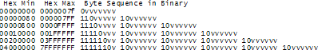

## 每一个软件开发者必须知道的关于Unicode和字符集的最基本的知识

*** 翻译自 https://www.joelonsoftware.com/2003/10/08/the-absolute-minimum-every-software-developer-absolutely-positively-must-know-about-unicode-and-character-sets-no-excuses/ ***


你是否想过Content-Type标签的用途？你也许知道应该在HTML中设置这个标签，但是你并不十分的清楚应该怎样设置？

你是否曾经收到过保加利亚的朋友发来的邮件，但是邮件的标题却是"???? ???? ??? ?????" ?

当我知道竟然有如此多的软件开发者并没有完全掌握字符集、编码、Unicode以及相关概念的时候，我感到很失望。几年之前，FogBUZG的一个测试人员想要知道这款软件是否可以处理用日文写的邮件。日文？它会碰到日文么？我不知道。当我查看用来解析MIME邮件信息的商用ActiveX控件时，我发现它并没有正确的处理字符集，所以我们不得不写一些夸张的代码，废除ActiveX对字符集的错误转换，重新做了正确的处理。无独有偶，当我查看另一个商业库的时候，发现它同样没有正确的处理字符集。我联系了库的开发者，他却认为他没有任何方法来处理字符集。像其他的程序员一样，他只是希望一切都会过去，不会遇到字符转换问题。

但是，不可能就这么过去的。当我发现最流行的web开发语言PHP完全忽略了字符编码，只简单的使用了8bit表示字符，导致几乎不可能开发出好的国际化web应用时，我觉得，实在是够了。


因此，我宣称：如果你是工作在2003年的一个程序员，并且你不懂字符、字符集、编码和Unicode的基础知识，一旦我发现了这一点，我将会惩罚你在潜艇中剥6个月的洋葱，我发誓我一定会做到的。

还有一件特别重要的事：熟悉字符集基础知识，其实并没有那么难！


本篇文章中，我将会向你介绍每一个程序员都应该知道的字符集知识。所有关于“plain text = ascii = characters are 8 bits”的言论都是错的，而且是完全错误的。如果你还在用这种思维来编程，你不会比一个不懂微生物的医学博士好到哪里去。请在阅读完本文之前，暂且停止编写代码。


在开始之前，我应该提醒那些已经知道国际化知识的朋友，你们可能会发现整篇文章有点过于简单了。事实上，我只想介绍一些字符集的最基础的知识，这些知识每个程序员都可以理解，然后运用这些知识让编写出的程序可以处理其他语言的字符，而不是仅限于英文。而且，还有一点我要指出，字符处理仅是编写国际化程序的一个最基本的部分，但同一时间我只能做一件事情，所以今天向大家介绍字符集。


### 从历史的角度看字符集

最简单的理解字符集的方式就是按时间顺序先后介绍字符集的由来和改变。

你可以认为我会讨论年代非常久远的字符集，比如EBCDIC，但是，我不会涉及那么古老的字符集，它与我们的生活毫无关系，我们没必要追溯到那么远。


回到过去的时间，当发明Unix的时候，K&R还在编写《The C Programming Language》这本书，所有的事情都很简单。这时候，EBCDIC已经快过时了。这时，唯一重要的字符就是老式的不带口音的英文字符，对它们的编码称为ASCII，ASCII编码可以使用32到127之间的数字来表示每一个英文字符。空格Space用数字32表示，大小字母'A'用65表示等等。这种表示法可以很容易的将每个字符存储为7个bit。那时候，绝大部分的电脑都使用8bit的字节，所以，每一个ASCII字符都可以存储到一个字节中，除此之外还余留出一个bit。这个余留的bit可以根据你自己的需要来达到一些特殊的目的。编码数值小于32的字符称为不可打印字符，它们是一些控制字符，比如7可以使你的电脑发生beep声音，12可以控制打印机打印一页纸。


一切看起来都工作的很好，假如你只讲英语的话。


因为一个字节有8位，ASCII编码只使用了7位，许多人就开始思考：我们可以使用128-255之间的数值来表示自己想要的其他字符。这个思考方向是好的，但是问题在于，许多人同时有这样的想法，而且他们的想法还各不相同。例如，IBM-PC使用128-255表示了一些欧洲字符和一些画线字符（水平线，竖直线等），你可以使用这些画线字符在屏幕上画出好看的盒子和线条，在某些使用8088计算机的干洗房中还可以见到这些字符，它们被称为OEM字符，如下所示。


事实上，当人们开始在美国之外购买PC的时候，各式各样的OEM字符就出现了，它们都利用高128位字符表示自己的用途。例如，在一些PC上，130表示的是字符 é，但是在以色列卖的PC上，编码130表示的是犹太字符γ，所以当美国人发送单词résumés给以色列的朋友时，朋友那边的电脑显示的可能是rγsumγs。在另外一些情况下，例如仅仅在俄罗斯内部，用高128位表示哪些字符，都有不同的方式，因此，即使全部用俄语编写的文档，有时也不能正常的交换阅读。


最终，这种完全自由的OEM表示法被统一为了ANSI标准。根据ANSI标准，每个人都保持128以下数值表示的字符的一致性，跟ASCII编码一致，但是128-255表示哪些字符，则根据你所在的地区来决定。这个系统被称为code pages。例如，在以色列，DOS使用的code page为862，但是在希腊，code page为737。它们0-127表示的字符是完全相同的，但是128-255表示的字符是不同的，许多有趣的字符都集中在这部分。国际化的MS-DOS版本有几十个code page，从英文字符到冰岛字符。它们甚至有一个多语言的code page，可以在同一个电脑上表示世界语和加利西亚语言(they even had a few “multilingual” code pages that could do Esperanto and Galician on the same computer!)。但是，如果想在同一台电脑上表示希伯来语和希腊语，则几乎是不可能的，除非你编写一个程序，用位图图形来表示所有字符，因为希伯来语和希腊语使用不同的code page，它们的128-255数值表示的字符是不相同的。

同时，在亚洲，需要考虑更疯狂的一个事实：亚洲字符有上千种，使用8bit根本不可能表示所有的亚洲字符。这种情况需要更复杂的系统DBCS来解决，DBCS是“double byte character set”的简称，在这种系统中，一些字符使用1个字节来表示，另外的字符使用两个字符来表示。使用这种表示法，在一个字符串中，我们可以很容易的向前移动，但是几乎不可能向后移动。这个时候，不推荐程序员使用s++或者s--进行字符的前后移动，而是使用Windows的AnsiNext和AnsiPrev函数，这些函数可以正确的处理这种乱象。


但是，大部分的人还是假装一个字节就是一个字符，一个字符就是8bit，只要你不会将一个字符串从一台电脑传输到另一台电脑，或者你不用两种语言，它总能正常运行。当然，这种想法是不成立的，在互联网普及的今天，电脑之间传输数据再正常不过了，这种想法面临崩塌。幸运的是，聪明的人类及时发明了Unicode。


### Unicode

Unicode字符集是一个勇敢的尝试，它试图包含世界上所有的字符。一些人认为Unicode仅仅是简单的16bit的代码，每一个字符使用16bit来表示，因此一共有65536种可能的字符，这种观念其实是错误的。这一点也是Unicode最为神秘的一点，许多人都会有上述想法，如果你也是其中一员，不用太惊讶。


其实，Unicode有很多不同的方式来思考字符，并且，你必须理解Unicode思考问题的方式，否则一切都没有意义。


到目前为止，我们假设一个字符会映射到一些bit，你可以在硬盘或者内存中存储这些bit： A -> 0100 0001。


在Unicode中，一个字母会映射到一个code point，而不是直接映射到bit级别。code point只是一个理论上的概念。这个code point如何在内存或者硬盘中表示（如何映射到bit），则是一个另外一个故事。（感觉这有点像class文件，class文件格式是固定的，同一个class文件，可以通过不同的虚拟机运行在不同的平台）。

在Unicode中，字母A是一个柏拉图式的理想，它只存在于天堂中。

字母A与字母B不同，与字母a也不同，但是与A、<b>A</b>、 <i>A</i>是相同的。Times New Roman字体的A和Helvetaca字体的A是相同的，但是它们不同与小写字母a，这看起来并没有太多的争议。但是在一些语言中，仅仅弄清楚什么是一个字母都可能会引起争议。比如，德国的字母ß是一个真实的字母还是仅仅是ss的一种奇特形式。如果一个字母的形状在单词的尾部会发生变化，那么这个形状变化了的字母算一个新字母吗？希伯来语中算，阿拉伯语中不算。无论如何，Unicode组织中最聪明的人已经在解决这个问题上花了差不多10年的时间，其中伴随着激烈的政治辩论。但是你无须担心这一点，他们已经想出解决办法了。


字母表中每一个纯粹的字母都会被Unicode组织分配一个如下形式的魔数：U+0639;这个魔数称为代码点（code point）。U+的意思是Unicode, 后面的数字是16进制的。U+0639代表阿拉巴字母Ain。英文字母A的代码点为U+0041。你可以找到所有字母的代码点，通过在Windows机器上使用charmap函数，或者访问Unicode官网。


Unicode可以表示的字母的数量是没有真正的限制，实际上，它能表示的字母已经远远超过65536个，所以，并非所有的Unicode字符都可以使用2个字节来存储。这里可能会有个迷惑点，以为Unicode代码点就是U+xxxx,其实，这里并非限制为4个16进制的数据，例如代码点U+10080也代表一个字符，参考：http://www.unicode.org/charts/PDF/U10080.pdf。

OK，假设有如下一个字符串： Hello

使用Unicode，可以将上述字符串表示为5个代码点：

U+0048 U+0065 U+006C U+006C U+006F

到目前为止，我们看到的只是一堆代码点，实际上，只是一堆数字。我还没有提及这些字符如何在内存中进行存储，或者怎样在邮件中显示。


### 编码

终于到了编码部分。

早期的编码想法是将每个Unicode代码点使用2个字节进行存储，这个思想正是导致现在许多人仍然认为Unicode字符跟2个字节相对应这种神秘说法的原因。应用上述编码，"Hello"在内存中的表示形式为：

	00 48 00 65 00 6C 00 6C 00 6F

看起来很自然？不要着急下结论，考虑如下表示形式:
	
	48 00 65 00 6C 00 6C 00 6F 00
	
	
在技术上来说，二者都是可以实现的。事实上，早期的实现者希望能以大端模式或者小端模式来存储代码点，根据他们的CPU在哪种模式下更快。所以，仅仅是以什么模式来存储代码点，就已经有了两种存储方式。因此，人们想出一种奇怪的约定，在每一个Unicode字符串的开头使用 FE FF开作为标志，这个标志称为 Unicode Byte Order Mark。如果你使用的是相反的模式，那么字符串开头应该设置为 FF EE。这样的话，读取这个字符串的人通过开头的标志，就知道他应该怎么处理code point。但是，由于历史原因，并非所有的Unicode字符串都在开头有这样的标志。


这样的想法暂时看起来还不错，但是很快，程序员开始抱怨起来。“看一看现在，到处都是0”，他们大声的抱怨，因为这些人基本是美国人，平时只会接触到英文字母，很少会用到U+00FF以上的代码点。同时，他们还是来自加利福尼亚洲的嬉皮士，发出阵阵讥讽。如果他们是德州人，也许他们并不在乎多浪费了一个字节，但是，对于加利福尼亚洲的瘪三来说，他们可无法忍受使用多一倍的存储空间来存储字符串。而且，对于那些已经使用ANSI或者DBCS字符集编写的大量文档，由谁来进行转码？Moi？仅仅由于这个原因，大部分的人决定忽视Unicode，持续了几年后，事情变得更糟糕了。

这时候，UTF-8应运而生。UTF-8是存储Unicode代码点的另一个系统，这些神奇的U+开头的数字，在内存中被表示成多个8bit的字节。在UTF-8中，0-127之间的每一个代码点在内存张存储为单个字节。128及其以上数值的代码点可能使用2个、3个或者高达6个字节来表示。



使用UTF-8的好处是使用UTF-8和使用ASCII编码的纯英文文档是一样的，因此，美国人甚至不会意识到编码已经改变。仅仅非英文的国家必须遵循这种编码格式。具体来说，Hello，用Unicode表示为 U+0048 U+0065 U+006C U+006C U+006F，用UTF-8编码来存储，则为 48 65 6C 6C 6F。瞧，它跟ASCII、ANSI和任务OEM字母编码都是一样的。现在，如果你想大胆的使用古老的希腊或克林贡字母，那么在内存中它会被表示为多个字节，但是美国人不会关心它，因为英文字母相对以前编码毫无变化。同时，UTF-8还有一个很好的特性，它可以忽略老式的字符串处理方法（使用一个0字节的标识作为字符串终结符），当遇到'\0'时，它不会截断字符串。


到目前为止，我已经介绍了3中编码Unicode字符集的方式。传统的使用2字节的方法被称为UCS-2或者UTF-16，同时，你必须判定它是使用大端模式的UCS-2还是小端模式的UCS-2。随后，出现了流行的UTF-8标准，UTF-8有很好的特性，对于纯英文文档和程序代码来说，它与ASCII是一样的，你甚至感觉不到任何变化，就像自己在使用ASCII一样。


其实，还有其他方法来编码Unicode字符集。有一种类似UTF-8的UTF-7编码，还有UCS-4编码，它使用4个字节存储一个代码点，优点是每个字符都被存储为等长的4字节，缺点自然是及其浪费存储空间。


事实上，现在你考虑问题，依据的是可以使用Unicode代码点表示的柏拉图式的理想字母。其实，这些Unicode代码点也可以使用任意的老式编码方案进行编码。例如，你可以使用ASCII、OEM或者ANSI编码以及其他任意的编码方案，来编码Unicode字符串Hello(U+0048 U+0065 U+006C U+006C U+006F)。但是有一点需要注意：一些字母可能无法显示！如果你所使用的编码中，没有与Unicode代码点等价的字母，你通常会得到一个问号标志“？”（如果将一个无法用ASCII编码的字符，使用ASCII来编码，它会把这个字符表示为63, 也就是'?'），或者你足够幸运，得到一个盒状的标志（菱形填充的图案中间有个问号, 将UTF-8编码的中文，使用ASCII来解码，得到一堆此标志，每个中文字对应3个此标志），你得到了哪种提示？

有一些老式的编码（比如ASCII编码），只可以表示部分Unicode代码点，对于其余的代码点，全部表示为'?'。另外一些流行的用于英文字母的编码还有Windows-1252和ISO-8859-1（也被称为Latin-1）。但是如果想使用这些编码方案来编码俄语或者希伯来语字母，你会得到一堆问号。UTF-7、8、16、32，都有一个很好的特性，就是可以正确的存储任意的代码点。


### 关于编码的最重要的事实

如果你已经忘了我刚才提及的大部分知识，那么请记住下面这一句最重要的事实。如果你不知道一个字符串的编码，那么这个字符串对你来说毫无意义。你不能将头埋进沙子，然后假装普通的纯文本就是ASCII, 你所理解的纯文本不存在的。

** There Ain’t No Such Thing As Plain Text **


如果你有一个字符串，在内存中或是在文件中抑或在邮件中，你必须知道它使用的是什么编码，否则你不能正确解析或者展示这个字符串。


几乎刚入门的程序员遇见的每一个“my website looks like gibberish”、“she can’t read my emails when I use accents”问题，原因都很简答，因为他们不知道这样一个最基本的事实：如果你不知道一个字符串是使用UTF-8或者ASCII或者ISO8859-1来编码的话，你可能就无法正确的解析这个字符串，你甚至无法计算出这个字符串在哪里结束。在大于127的代码点中，上百种编码方案的表示法都不一致，你赌赢字符集的概率并不高。


那么，我们在哪里存储一个字符串的编码信息呢？其实，有几种标准的方式来存储这些编码信息。对于email信息，你可以使用以下的声明：

```
Content-Type:text/plain; charset="Utf-8"

```

对于网页文档，最原始的方式是让web服务器返回一个http header---Content-Type，而不是将这个信息嵌套在html文件中。


这就引起了问题。假设你有一个大的web服务器，在这个服务器上运行着许多个网站和几百个网页，这些网站来自不同国家的，使用不同的语言。web服务器本身并不知道每个网页具体使用的什么编码，因此它就无法正确的返回Content-Type头。

如果把Content-Type信息，使用特殊的tag，直接嵌套在html文件本身中，则可以解决上述问题。但是，这使得洁癖者抓狂了。只有在知道html文件的编码后才可以阅读html文件？幸运的是，我们通常使用的每种编码，几乎都对32-127代码点之间的字符有同样的编码，所以你可以在Html中使用这些字符来传递Content-Type信息：

```
<html>
	<head>
		<meta http-equiv="Content-Type" content="text/html;charset=utf-8">
	</head>
	...
</html>

```

但是，需要注意的是，这个meta标记必须位于head标签的最前面，因为一旦浏览器遇到这个标签，它就停止解析网页，然后使用指定的编码重新解析整个网页。如果浏览器没有发现这个标签，无论是在http header还是在html文件中，那么此时该怎么办？IE浏览器会进行一个有趣的操作：它会试图猜取此网页使用的编码，根据每个字节出现的频度。因为不同的语言使用的字符频度各有不同，而且在128到255代码点之间的表示法也不尽相同，所以这种猜测确实有效。这看起来很奇怪，但是确实有效。


本文确实很长，我不可能覆盖关于字符集和Unicode的方方面面知识，但是我希望，既然你已经阅读到了末尾，你有足够的关于字符集的知识了，可以回去继续编程了，我留给各位的最后一个任务是：使用抗生素代替水蛭和咒语。


