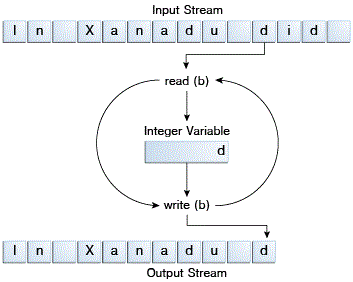

## Byte Stream

程序可以使用字节流来自执行8-bit的字节输入/输出操作。所有的字节流都是InputStream或者OutputStream的子类。


JDk中提供了许多字节流。为了阐述字节流是如何工作的，本节我们主要讨论文件输入输出字节流，FileInputStream和FileOutPutStream。其他类型的字节流使用方式差不多，主要区别在于构造方式。


### 使用字节流

我们将使用如下的实例程序CopyBytes来探索FileInputStream和FileOutPutStream，CopyByte使用字节流来拷贝xanadu.txt，一次拷贝一个byte：


```
import java.io.FileInputStream;
import java.io.FileOutputStream;
import java.io.IOException;


public class CopyBytes {
	public static void main(String[] args) throw IOException {
	
		FileInputStream in = null;
		FileOutputStream out = null;
		
		try {
			in = new FileInputStream("xanadu.txt");
			out = new FileOutputStream("xanadu.txt");
			int c;
			
			while ((c = in.read()) != -1) {
				out.write(c);
			}
		} finally {
			if (in != null) {
				in.close();
			}
			if (out != null) {
				out.close();
			}
		}
	}

}

```


CopyBytes在一个while循环中，不断的读输入流并且写输出流，每次读或者写一个字节，如下图所示：




### Always Close Streams

当不使用的时候，将流进行关闭是很重要的--关闭操作非常重要，以至于CopyBytes使用了一个finally块来保证流的关闭，即使在发生错误时候。这可以避免资源泄露。


一个可能的错误是CopyBytes无法打开一个或者两个文件都无法打开。当这个错误发生时，与文件相关的流还是初始值null，所以在finally块中关闭流的时候首先判断了流是否为null。


### 什么时候不适合使用字节流

CopyBytes看起来是一个普通的程序，但是它其实代表了一种低级的I/O操作，你应该避免使用这种low-level的操作。因为 xanadu.txt 包含字符数据，所以更好的方式是使用字符流，下一节将会讨论字符流。Java平台中还有处理更复杂的数据的流。字节流只在最基本的I/O操作中使用。


那么，为什么首先讨论字节流？因为其他的所有流都在建立在字节流之上的。


