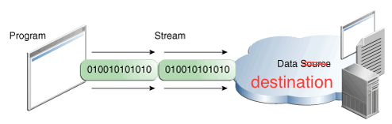

## I/O Streams

一个 I/O stream代表一个输入源或一个输出目的地。一个stream可以代码很多不同类型的源头和目的地，包括磁盘文件，设备，其他程序和内存。

Streams支持很多不同种类的数据，包括简单的字节、原始数据类型、本地字符和对象。一些流只是简单的传递数据，而其他的流可能会操作和转换数据。


不管在内部它们是怎样工作的，对于使用它们的程序来说，所有的流都代表了相同的简单的一个模型：一个流是一个数据序列。一个程序使用输入流从源头读取数据，一次读取一个item：


一个程序使用一个输出流向目的地写数据，一次写一个item：




在本节教程中，我们将看到能处理各种类型数据的流，从基本数据类型到高级的对象。


上面图中的数据源和数据目的地可以是持有、生成或者消费数据的任务东西。通常我们操作的是磁盘文件，但是它们可以是另外的程序、一个外围设备、网络套接字或内存。


在下一节中，我们将会使用最基本的流，字节流，来阐述对流的基本操作。作为输入示例，我们会使用示例文件xanadu.txt，包含下面的内容：

```
In Xanadu did Kubla Khan
A stately pleasure-dome decree:
Where Alph, the sacred river, ran
Through caverns measureless to man
Down to a sunless sea.

```


