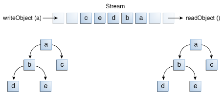

### Object Streams

对于基本数据类型，可以使用数据流，对于引用数据类型，我们可以使用对象流。大部分的标准类都支持对象序列化操作，它们实现了标记接口--Serializable。


对象流类包括ObjectInputStream和ObjectOutputStream。这些类实现了ObjectInput和ObjectOutput，上述两个接口又是DataInput和DataOutput的子接口。这表示，对象流也实现了对基本数据类型的I/O操作。因此，一个对象流可以同时包含基本数据类型和引用数据类型的值。ObjectStreams示例在DataStreams的基础上进行了修改。将prices改成了BigDecimal类型的数组，同时，将一个Calendar对象也写入了文件，表示发票的日期。


如果readObject()没有返回期望的对象类型，那么在试图进行类型转换时可能会抛出ClassNotFoundException。在这个简单的例子中，不会抛出这种异常，因此我们也没有去捕获这个异常。取而代之，我们在main方法声明中，声明抛出ClassNotFoundException，来告诉编译器我们意识到了可能会发生这种异常。


### Output and Input of Complex Objects

writeObject和readObject方法用起来很简单，但是它们包含了非常复杂的对象管理逻辑。对于Calendar这类简单的对象来说，它只包含了基本数据类型的域，处理起来并不复杂。但是，很多对象会包含对其他对象的引用。如果readObject想要重建一个对象，那么它必须先重建这个对象引用的其它对象，而这些其它的对象又可能引用其它的对象。在这种情况下，writeObject方法会遍历所有的对象引用关系，将关系网中的所有对象转化为二进制流。因此，一个简单的writeObject方法调用可能会将很多对象写入输出流。


上述描述的情形可以用下面的表格来阐述，我们仅仅调用了writeObject方法来将a对象写入输出流。a对象包含对b和c的引用，而b包含对d和e的引用。所有，调用writeObject(a)时，并不仅仅序列化了a对象，它同时还序列化了构建a需要的b、c、d和e对象。当调用readObject(a)时，其他的4个对象也会被重建，所有的原始对象引用关系也被保留了下来。





你也许会好奇，如果对象流中有两个对象持有同一个其它对象的引用，那么会发生什么。当反序列化时，它们持有的同一个对象引用吗？答案是“yes”。一个流仅包含对象的一个copy，尽管可以包含对这个对象的多个引用。因此，如果你显示的将一个对象往流中写2次，你仅仅是将引用写了2次。例如，下面的代码：


```

Object ob = new Object();

out.writeObject(ob);
out.writeObject(ob);

```

每一个writeObject方法对应一个readObject方法，所以，当读取的时候代码：

```
Object ob1 = in.readObject();
Object ob2 = in.readObject();

```

结果保存在两个变量ob1和ob2中，ob1和ob2指向的是同一个对象，但是ob1和ob2与原始的ob指向的不是同一个对象。


但是，如果一个对象写入两个不同的流中，它们会被写2遍，读取两次，会得到两个不同的对象。


