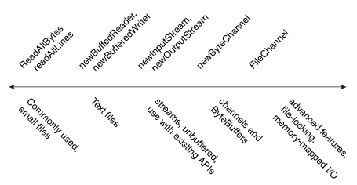

### Reading, Writing and Creating Files

本节将详细讨论如何读写以及创建文件。关于这几种操作，你有很多种可选的方法。为了有助于理解API，下面的图表以复杂度由低到高来归类了各个方法：




在最左边的是功能性方法：readAllBytes、readAllLines和write方法。这些方法是设计用来读取简单的、普通的用例。它的右边是用来迭代一个流或者多行文件的方法：newInputStream、newOutputStream、newBufferedRead、newBufferedWriter，这几个方法可以与java.io包的API配合使用。再右边是用来处理ByteChannels、SeekableByteChannels和ByteBuffers的方法。最后，也就是最右边，是使用FileChannel来进行更高级的操作，例如锁定文件或者内存映射I/O等。


** 注意：创建一个新文件的方法允许你指定一些初始文件属性。例如，在支持POSIX的文件系统中，你可以在创建文件时，指定文件拥有者、组拥有者、文件权限等。上一节Managing Metadata介绍了文件属性以及如何访问和设置这些属性。**


#### The OpenOptions Parameter

本节中的一些方法会接受OpenOptions类型的可选参数。这个参数是可选的，API也描述了当不指定这个参数时，默认行为是什么。

JDK支持下面的StandardOpenOptions枚举：

* WRITE : 以写权限打开文件
* APPEND : 将数据append到文件尾部，这个选项通常和WRITE或者CREATE同时使用。
* TRUNCATE_EXISTING : 截断文件，即清空文件为0 byte。这个选项通常和WRITE同时使用。
* CREATE_NEW : 创建一个新文件，当文件已存在时，抛出异常
* CREATE : 打开一个文件，如果这个文件存在；不存在，则创建一个新文件
* DELETE_ON_CLOSE : 当stream关闭的时候删除文件，这在创建临时文件时很有用。
* SPARSE : 暗示一个新创建的文件应该被压缩。这个高级的选型被一些文件系统所支持，例如NTFS，当一个大型文件有很多gaps时，通过将这些gap以某种方式来表示，使其占用很少的磁盘的方法，可以更有效的存储这个文件。
* SYNC : 使文件(包括文件内容和属性)与底层存储设备保持同步
* DSYNC : 使文件内容与底层存储设备保持一致


#### Commonly Used Methods for Small Files

##### Reading ALl Bytes or Lines from a File

如果你有一个小文件，你想一次性读取它的所有内容，你可以使用readAllBytes(path)或者readAllLines(path, Charset)方法。这些方法封装了很多细节，方便你的使用，例如打开和关闭stream。但是这两个方法对于大型文件则不适用，代码示例如下：

```
Path file = ...;
byte[] fileArray;

fileArray = Files.readAllBytes(file);

```

##### Writing ALl Bytes or Lines to a File

你可以使用如下的方法将bytes或者lines写入一个文件：

* write(Path, byte[], OpenOption...)
* write(Path, Itreable<? extends CharSequence>, Charset, OpenOption...)

代码示例：

```
Path file = ...;
byte[] buf = ...;
Files.write(file, buf);

```


#### Buffered I/O Methods for Text Files

java.nio.file 包支持channel I/O，它会将数据写入buffer，在一些层面避免了stream I/O的瓶颈。


##### Reading a File bu Using Buffered Stream I/O


newBufferedReader(Path, Charset)方法打开一个文件，返回一个BufferedReader实例，接下来可以使用这个实例以更高效的方式来读取文件。


下面的代码展示了如何使用newBufferedReader方法来读取一个文件，这个文件编码为"US_ASCII"。


```
Charset charset = Charset.forName("US_ASCII");
try (BufferedReader reader = Files.newBufferedReader(file, charset)) {
	String line = null;
	while ((line = reader.readLine()) !=  null) {
		System.out.println(line);
	}
} catch (IOException x) {
	System.out.format("IOException: %s%n", x);
}

```

##### Writing a File by Using Buffered Stream I/O

你可以使用newBufferedWriter(Path, Charset, OpenOption...)方法来使用BufferedWriter写文件。

```
Charset charset = Charset.forName("US_ASCII");
String s = "...";
try (BufferedWriter writer = Files.newBufferedWriter()) {
	writer.write(s, 0, s.length());
} catch (IOException x) {
	System.err.format("IOException: %s%n", x);
}

```


#### Methods for UnBuffered Streams and Interoperation with Java.io APIs


##### Reading a File by Using Stream I/O

为了打开一个文件，你可以使用newInputSteam(Path, OpenOption...)方法。这个方法返回一个不具备缓冲功能的input stream，接下去可以使用这个inputStream来读取文件的内容。


```
Path file = ...;
try (InputStream in = Files.newInputStream(file);
	BufferedReader reader = new BufferedReader(new InputStreamReader(in))) {
	String line = null;
	while ((line = reader.readLine()) != null) {
		System.out.println(line);
	}
} catch (IOException x) {
	System.err.println(x);
}


```

##### Creating and Writing a File by Using Stream I/O


你可以通过使用newOutputStream(Path, OpenOption...)创建一个文件、append文件或者写文件。这个方法会打开一个文件，或者文件不存在时可能创建一个文件，并且返回一个不具备缓冲功能的output stream。


这个方法接收一个可选的OpenOption参数。如果不指定任何的option，且文件不存在，那么会创建一个新文件。如果文件存在，它被清空。这个默认行为，类似于同时指定option： CREATE和TRUNCATE_EXISTING.

下面的示例代码打开了一个log文件，如果这个文件不存在，则创建log文件，如果存在，则append：

```
public class LogFileTest {
	public static void main(String[] args) {
		String s = "Hello World!";
		byte[] data = s.getBytes();
		Path p = Paths.get("./logfile.txt");
		
		try (OutputStream put = new BufferedOutputStream(Files.newOutputStream(p, CREATE, APPEND))){
		out.write(data, 0, date.length);
		} catch (IOException x) {
			System.err.println(x);
		}
	}
}

```


#### Methods for Channels and ByteBuffers

##### Reading and Writing Files by Using Channel I/O

stream I/O每次读取一个字节，channel I/O每次读取一个buffer。ByteChannel接口提供了两个基本的read和write方法。一个SeekableByteChannel扩展了ByteChannel，并且维持了一个position，它可以动态改变这个position。SeekableByteChannel同时支持截断与这个channel关联的文件、查询文件的size等操作。

因为可以任意的改变文件读取的当前位置，所以随机访问文件的功能得以实现。更多关于随机访问文件的信息，后面章节将会详细介绍。

有两个基本的方法可以读写channel I/O:

* newByteChannel(Path, OpenOption...)
* newByteChannel(Path, Set<? extends OpenOption>, FileAttribute<?>...)


** 注意： newByteChannel方法返回一个SeekableByteChannel的实例。在默认的文件系统中，你可以将这个实例强转为FileChannel类型，FileChannel提供了更高级的特性，例如：内存映射文件、lock文件的部分区域以防止其他进程访问文件、通过绝对位置来读写文件而不会影响当前的position等。 **


两个newByteChannel方法都可以指定一系列OpenOption。所有newOutputStream支持的option，newByteChannel都支持，除此之外，还支持一个Option： READ。因为，SeekableByteChannel同时支持读和写操作。

对于读操作，需要指定READ Option。对于写操作，需要制定 WRITE或者APPEND Option。如果不指定任何Option，那么默认读。

示例代码读取了一个文件，并打印到标准输出：

```
try (SeekableByteChannel sbc = Files.newByteChannel(file)) {
	ByteBuffer buf = ByteBuffer.allocate(10);
	String encoding = System.getProperty("file.encoding");
	while (sbc.read(buf) > 0) {
		buf.rewind();
		System.out.println(Charset.forName(encoding).decode(buf));
		buf.flip();
	}
} catch (IOException x) {
	System.err.println("caught exception: " + x);
}

```

下面的代码，适用于UNIX或者其他POSIX文件系统，创建了一个log file，并且指定了一些初始的文件权限信息。如果log文件存在，则append。文件权限为： 文件拥有者有读写权限，所在组只有读权限, 其他组没有权限。


```
public class LogFilePermissionsTest {
	public static void main(String[] args) {
		Set<OpenOption> options = new HashSet<OpenOption>();
		options.add(APPEND);
		options.add(CREATE);
		
		Set<PosixFilePermission> perms = PosixFilePermissions.fromString("rw-r-----");
		FileAttribute<Set<PosixFilePermission>> attr = PosixFilePermissions.asFileAttribute(perms);
		
		String s = "Hello World!";
		byte[] data = s.getBytes();
		ByteBuffer bb = ByteBuffer.wrap(data);
		
		Path file = Paths.get("./permission.log");
		try (SeekableByteChannel sbc = Files.newByteChannel(file, options, attr)){
			sbc.write(bb);
		} catch (IOException x) {
			System.out.println("Exception thrown: "+ x);
		}
	}
}

```


#### Methods for Creating Regular and Temporary Files

##### Creating Files

你可以使用createFile(path, FileAttribute<?>)方法来创建一个空文件。例如，如果你想在创建文件的同时，指定初始的文件属性，就可以使用上述方法。如果你没有指定任何的属性，那么文件拥有默认的属性。如果文件已存在，createFile方法会抛出异常。


createFile方法会在一个原子操作中，先检查文件是否已存在，然后使用初始的属性来创建一个文件，这样可以更安全的操作文件。

```
Path file = ...;

try {
	Files.createFile(file);
} catch (FileAlreadyExistsException x) {
	System.err.format("file name %s already exists%n", file);
} catch (IOexception x) {
	System.err.format("createFile error: %s%n", x);
}

```

POSIX File Permission 一小节有示例来展示如何使用createFIle(Path, FileAttribute<?>)，来创建文件的同时指定初始化属性。


你也可以通过newOutputStream()方法来创建一个文件。如果你打开一个output stream，然后随即又关闭了它，就会创建一个空文件。


##### Creating Temporary Files

你可以使用如下两个方法来创建临时文件：

* createTempFile(Path, String, String, FileAttribute<?>)
* createTempFile(String, String, FileAttribute<?>)


第一个方法允许你指定临时文件的存放位置，第二个方法将临时文件存放在默认的临时文件目录中。两个方法都能指定文件名的前缀和后缀，示例代码如下：

```
try {
	Path tempFile = Files.createTempFile(null, ".mapp");
	System.out.format("The temporary file has been created: %s%n", tempFile);
} catch (IOException x) {
	System.err.format("IOException: %s%n", x);
}

```

程序的结果可能是：

```
The temporary file has been created: /tmp/509668702974537184.myapp

```

临时文件的名称规则是平台特定的。


