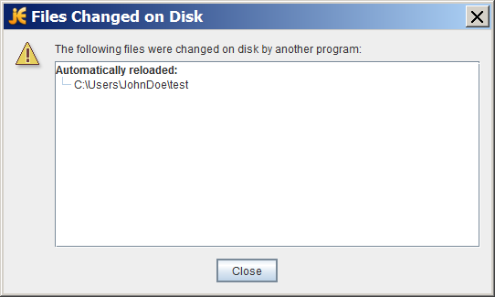

### Watching a Directory for Changes

你是否曾经遇到过这种情况，当你在IDE或其他编辑器编辑一个文件的时间，弹出一个对话框，通知你当前打开的一个文件已经发生了改变，需要重新加载？或者，如果你使用NeeBeans IDE，IDE会默默的更新你的文件，而没有显示的通知你。下面的对话框展示了JEdit编辑器的提示框。




为了实现文件改变通知功能，一个程序必须能检测文件系统中的一个目录发生了什么。一个简单的方法是轮询文件系统，查询改变，但是轮询机制效率低下。轮询机制不适用于拥有几百上千个文件或者目录的大规模程序。


java.nio.file包提供了实现文件更改通知功能的API，称为Watch Service API.这个API允许你给一个目录注册一个watch Service。注册的时候，你需要告诉这个Service，你对什么事件感兴趣，比如文件创建、文件删除、文件修改等。当这个Service检测到一个你感兴趣的时间时，它就会转向注册的进程。注册的进程通常有一个线程（或者一个线程池），来专门的等待处理感兴趣的时间。当一个时间到来时，它就按部就班的处理。


#### Watch Service Overview

WatchService API非常的底层，它允许你自定义它的很多功能。你可以直接使用它，或者你也可以基于这个底层的API创建更高层的API，这个更高层的API更适用于你的应用。


实现一个watch Service的常用步骤如下：

* 创建一个WatcherService对象“watcher”
* 注册每一个你想要监视的目录到watcher，当注册一个目录时，你需要指定你感兴趣的event type，当特定的event type发生的时候，你就会收到一个WatchKey实例
* 用一个无线循环来等待事件的发生，当一个事件到来时，key的状态变为signaled，并且会放入watcher内部的队列中
* 检索watcher队列中的每一个key，你可以从key中获取文件名等信息
* reset key，继续监视
* 关闭服务：监视的线程退出后watcher service也将关闭，或者可以调用close方法手动关闭wather service。


WatchKeys是线程安全的，可以与java.nio.concurrent包的类配合使用。


#### Try it Out

因为这个API非常的高级，所以在继续下面的章节前，请先尝试一下。可以下载WatchDir的源代码到你本地，编译它。创建一个test目录，然后监视这个目录。WatchDir使用了一个单线程来处理所有的事件，因为当它等待事件时会阻塞键盘输入。你可以在单独的窗口运行这个程序，或者在后台运行这个程序。

```
java WatchDir test &

```

接下来在test目录中执行创建、删除、编辑文件的操作。当这个操作完成时，控制台就会打印一条信息。当你完成了测试，删除test目录，WatchDir会自动退出。或者，你可以手动kill这个进程。


你也可以使用-r选项来指定监视整个文件树。当你指定了-r选项时，WatchDir会walk file tree，将每一个目录就注册到watch service。


#### Creating a Watch Service and Registering For Events


第一步就是使用FileSystem.newWatchService()方法来创建一个WatchService，如下所示：

```
WatchService watcher = FileSystems.getDefault().newWatchService();

```

第二步，注册需要监视的目录。任何实现了Watchable接口的对象都可以被注册。Path类实现了Watchable接口，因此每一个被监视的目录对会将对应的Path对象进行注册。


Path类实现了Watchable接口的两个方法。本节使用了接收两个参数的方法，register(WatchService, WatchEvent.Kind<?>...)。接收3个参数的方法，第三个参数为一个WatchEvent.Modify对象，目前还未实现。


当向Watch Service注册一个对象时，你需要指定需要监视哪些事件，目前支持的事件为： StandardWatchEventKinds类中定义的一些常量：

* 	ENTITY_CREATE  目录中的实体(文件、目录)创建事件
* 	ENTITY_DELETE  实体删除事件
* 	ENTITY_MODIFY  实体修改事件
* 	OVERFLOW 表示事件可能已经丢失或者被丢弃。即使你不注册OVERFLOW事件，在发生这种事件的时候，你也会收到通知，所以即使你没有显示注册这个事件，你也应该在处理时对这种事件做一个判断。


```
import static java.nio.file.StandardWatchEventKids.*;

Path dir = ...;

try {
	WatchKey key = dir.register(watcher, ENTITY_CREATE, ENTITY_DELETE, ENTITY_MODIFY);
} catch (IOException x) {
	System.err.println(x);
}

```

#### Processing Events


处理一个event中的事件的步骤为：

1. 得到一个watch key， 这一步有3个方法可以使用：
	* poll--如果有事件发生，返回一个key，如果没有事件发生，返回null
	* poll(long, TimeUnit)--如果有事件发生，返回key。如果没有事件发生，那么等待指定的时间。
	* take--等待知道事件发生，返回key
2. 处理key中带来的事件，通过调用pollEvents方法来得到一个WatchEvents列表
3. 遍历key中的事件，通过kind方法，查看event的类型。无论你注册了什么类型的事件，都有可能收到OVERFLOW事件，所以你需要判断事件类型，当遇到OVERFLOW事件是你可以处理它或者忽略它
4. 得到event对应的file name，这里你可以使用context()方法
5. 当处理完key中的所有event后，你需要使用reset方法，将key重置为ready状态。如果reset方法返回false，那么这个key不再有效，循环可以终止了。这一步非常重要，如果你没有调用reset方法重置key的状态，那么你将不会收到接下来发生的任何事件。


一个watch key是有状态的，在任意的时间，它可能处于下面的几种状态之一：

* Ready： 表示这个key准备好了接收时间，当一开始创建watch key时，它处于ready状态
* Signaled：表示一个或者事件发生了。一旦key处于signal状态，它就不会再接收事件了，直到调用reset方法进行重置。
* Invalid：表示这个key不在active。当如下的事情发生时，key可能会invalid：
	* 使用cancel方法，取消了这个key
	* directory变为不可访问
	* watch service 被关闭了
	
	
下面是事件处理的一个示例。它摘自与Email示例，它会监视一个目录，等待新文件的到来。当一个新文件到来时，它会判断这个文件是否是一个test/plain文件，这是通过Files.probeContentType()方法来做到的。


```
for(;;) {
	try {
		key = watcher.take();
	} catch (InterruptedException x) {
		return;
	}
	
	for (WatchEvent<?> event : key.pollEvents()) {
		WatchEvent.Kind<?> kind = event.kind();
		
		if (kind == OVERFLOW) {
			continue;
		}
		
		WatchEvent<Path> ev = (WatchEvent<Path>) event;
		Path filename = en.context();
		
		try {
			Path child = dir.resolve(filename);
			if (! Files.probeContentType(child).equals("test/plain")) {
				System.err.format("New file '%s' is not a plain text file.%n", filename);
				continue;
			}
		} catch (IOException x) {
			System.err.println(x);
			continue;
		}
		System.out.format("Emailing file %s%n", filename);
	}
	
	boolean valid = key.reset();
	if (! valid) {
		break;
	}
}

```


#### Retrieving the File Name

文件名可以通过context()方法来获得。

```
WatchEvent<Path> ev = (WatchEvent<Path>) event;
Path filename = ev.context();

```

当编译Email示例时，它产生了如下的error：

```
Note: Email.java uses unchecked or unsafe operations.
Note: Recompile with -Xlint:unchecked for details.

```


这个error是由 WatchEvent<Path> ev = (WatchEvent<Path>) event; 强制类型转换引起的。可以使用@SuppressWarnings 注解来避免这个error：

```
@SuppressWarning("unchecked")
static <T> WatchEvent<T> cast(WatchEvent<?> event) {
	return (WatchEvent<Path>) event;
}

```


#### When to Use and Not Use This API

Watch Service API是设计为那些需要文件更改通知的应用程序来使用的。它适用于很多程序，比如一个编辑器、IDE，这些应用通常会打开很多文件，它们需要保证打开的文件与文件系统的文件保持一致。Watch Service API同样适用于这样的应用程序，它需要监视一个目录，比如在等待放入目录中.jsp和.jar文件，然后就可以deploy这些文件。


Watch Service API并不是设计用来进行硬件驱动索引的。大多数的文件系统的实现原生支持文件更改通知机制。Watch Service API底层也是调用文件系统提供的这种原生支持。如果文件系统不提供这种原生支持，那么Watch Service 将会对文件系统进行轮询，等待event。


