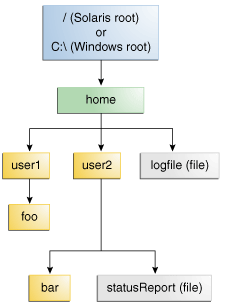

### What Is a Path? (And Other File System Facts)

一个文件系统在某种媒介上存储和组织文件，通常有1个或者多个硬盘驱动器，可以轻松的索引文件。现在使用的大多数文件系统以树的结构（或称为层级结构）来存储文件。在树的顶端是一个或多个root节点。在root节点下，有文件和目录(windows称为文件夹)。每一个目录可以包含文件和子目录，子目录又可以包含文件和子目录，以此类推。

#### What Is a Path?

下面的图形展示了一个简单的目录树，它只有单个root节点。windows支持多个root节点，每一个root节点映射到一个volume，例如： C:\ 或者 D:\。 Solaris OS支持单个root节点，用斜杠'/'表示。

一个文件通过文件系统中的path来定义，从root节点开始。例如，上图中的statusReport文件通过如下的path来表示： 

* Solaris OS: /home/user2/statusReport
* Windows: C:\home\user2\statusReport

不同的文件系统使用的目录分隔符不同，Solaris OS使用正斜杠'/'，Windows使用反斜杠'\'。

#### 相对路径 vs 绝对路径

一个路径可以是绝对的或者相对的。一个绝对路径总是从root节点开始，包括完整的目录列表，用来定位一个文件。例如，/home/sally/statusReport就是一个绝对路径，它包括用来定位一个文件的所有信息。

一个相对路径需要与灵位一个路径结合起来，定位一个文件。例如，joe/foo是一个相对路径，如过没有更多的信息，一个程序不能利用此相对路径来定位文件系统中的一个文件。

#### Symbolic Links

文件系统对象绝大多数是目录或者文件。每个人都熟悉这些对象。但是，一些文件系统还支持“符号链接”的概念。一个符号链接也称为 symlink 或者 soft link.

一个符号链接是一个特殊的文件，它指向另一个文件。在大部分情况下，符号链接对应用是透明的，对符号链接的操作会自动重定向到它指向的目标文件(被符号链接指向的文件称为target of the link)。当一个符号链接被删除或者重命名之后，它指向的文件是不变的，仅仅删除或重命名了符号链接本身。

下面的图表中，对用户来说，logFile就像一个常规的文件，但实际上它是一个符号链接，指向 'dir/logs/HomeLogFile'. HomeLogFile就是target of the link。

一个符号链接对用户来说通常是透明的。对符号链接的读写操作与对其他文件的读写操作是一样的。

'resolving a link'指的是用文件系统中的实际位置来替代符号链接。上述示例中，resolving logFile将会得到 dir/logs/HomeLogFile.

在真实场景中，绝大多数的文件系统允许自由的使用符号链接。有时，不经意的创建一个符号链接可能引起一个循环引用。当符号链接的目标文件又指向这个符号链接时，就会发生循环引用的问题。循环引用可能是间接的：目录a指向目录b，目录b指向目录c，目录c包含一个子目录，这个子目录又指向目录a。当递归的访问目录结构时，循环引用可能引起浩劫。但是，我们已经被考虑到了这种场景，它不会使你的程序陷入无限循环。

