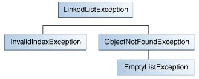

## 创建异常类

当选择抛出何种类型的异常时，你可以使用别人已经编写好的异常类--例如java平台提供的异常类，或者你可以自己编写异常类。在如下情况下，如果你的答案是yes，那么你需要编写自己的异常类，否则考虑使用别人编写好的异常类：

* 你是否需要一种异常类型，而java平台没有提供这种类型？
* 如果你使用自己的异常与别人的异常进行区分，是否能帮助用户？
* 你的代码是否会抛出多于一个异常？
* 如果你使用别人的异常，用户是否可以访问到这些异常？或者说，你的package是否需要独立自包含？

### 一个示例

假设你正在编写一个LinkedList类，这个类支持如下的方法：

* objectAt(int n)--返回第n个位置的object。如果参数小于0或者大于链表中的元素，那么抛出一个异常。
* firstObject()--返回list的第一个元素。如果链表是空的，抛出异常。
* indexOf(Object o)--在链表中搜寻对象o所在的位置，如果找不到，抛出异常。

如上所示，LinkedList可能会抛出多种异常，如果可以使用一个异常处理器来捕获多个异常，那将会很方便。同时，如果你打算将LinkedList放在一个package中供别人使用，那么所有相关的类都应该打包在一起。因此，LinkedList应该提供自己的异常集合。

下面的图描述了LinkedList的一个可能的异常集合体系：

### 选择一个父类

任意Exception的子类都可以作为LinkedListException的父类。但是，通过简单的搜寻所有的异常类，我们可以发现没有一个Exception的子类是适合的，它们要么太具体了，要么与LinkedListException完全不相关。因为，LinkedListException的直接父类应该是Exception类。

你编写的大部分应用程序抛出的都是Exception对象。Errors通常表示严重的系统错误，比如导致JVM无法运行的错误。

** 注意：为了增加可读性，在编写自己的异常类时，最好以Exception作为类名的结尾。 **

