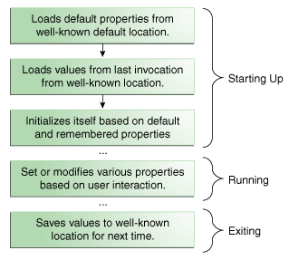

### Properties


Properties是以键值对形式来管理的配置数据。对于每个键值对，键和值都是String类型。key用来检索value，类似于通过一个变量名来检索一个变量值。例如，一个允许下载文件的应用，可能会使用一个property，其key为"download.lastDirectory"，其值为最后下载的文件所在的目录。


为了管理属性，创建一个java.util.Perperties的实例，这个类提供了如下的几个重要方法：

* 从一个stream中加载key/value pairs
* 通过key检索value
* 列出所有的key和value
* 迭代所有的key
* 将properties写到一个stream中


参考Basic I/O中的I/O stream一节，了解更多stream的知识。


Properties类继承自HashTable。一些从HashTable继承而来的方法，可以做如下操作：

* 检测指定的key是否在Properties对象中
* 获取键值对的数量
* 移除一个键值对
* 增加一个键值对
* 枚举键值对
* 根据key检索value
* 检查一个Properties对象是否为空


** 安全性考虑： 对于properties的访问通常受安全管理器的控制。本节的示例代码假设是一个独立的应用，没有安全管理器。 对于applet， 同样的代码可能无法运行，取决于它所运行的浏览器。**


System类维护着一个Properties对象，这个对象定义了应用所在的平台环境的配置。想了解这些配置，参考后续的章节System Properties。本节剩余部分将集中解释如何使用Properties对象管理应用配置。


#### Properties in the Application Life Cycle


下面的图表展示了一个典型的应用如何使用Properties，在它的整个执行过程中管理配置数据。




* Starting Up

上图中的前三步是应用启动时候通常会执行的三个动作。首先，应用会从默认的位置来将配置文件加载到一个Properties对象中。通常，默认的配置会存储在一个磁盘文件中，跟.class和resource文件存放在一起。然后，应用通常会创建另一个Properties对象，然后从一个规定的位置来加载上一次应用退出时保存到磁盘中的配置。许多应用会以用户的维度来存储配置，因此，这一步加载的配置文件所在的位置通常在用户的家目录下的某一个目录或者文件。最后，应用使用默认配置和某一用户的特殊配置来进行自身的初始化。这一步的关键在于前后的一致性。应用必须保证总是从同一个位置加载和保存配置数据，这样它下一次启动时才能找到上一次保存的配置文件。

* Running

在应用运行期间，用户或许可以改变一些配置属性，通过偏好设置窗口等方式。应用内部维护的Properties对象会实时更新。如果用户不想每次都修改这个属性，想要在下一次自动生效，那么这些属性必须被持久化。

* Exiting

当应用退出时，应用会将属性保存到一个指定的位置，当下一次启动时，再从该位置加载配置。


#### Setting Up the Proeprties Object


下面的java代码对应上面Starting Up步骤中的前两步：加载默认的配置文件、加载上次应用退出时保存的用户特定的配置文件。


```
// create and load default properties
Properties defaultProps = new Properties();
FileInputStream in = new FileInputStream("default/.xxx");
defaultProps.load(in);
in.close();

// create application properties with default
Properties applicationProps = new Properties(defaultProps);

// now load properties from last invocation
in = new FileInputStream("/Users/cy/app.default");
applicationProps.load(in);
in.close;

```

首先，应用会创建一个默认的Properties对象。这个对象包含应用的默认配置。然后，应用会从磁盘文件default/.xxx加载默认配置，转化为Properties对象。


接下来，应用会使用一个不同的Properties的构造函数来创建第二个Properties对象，applicationProps，applicationProp的defaults域被设置为defaultProps。当一个属性在applicationProps中搜寻不到时，就会去defaultProps搜寻这个属性。


最后，应用从/Users/cy/app.default文件中加载一些配置。这个文件中的配置是上一次应用退出时保存到此文件中的。


#### Saving Properties

下面的代码使用Properties.store方法，将配置写到一个文件中。默认的配置不用每次都保存，因为它们不会改变。

```
FileOutputStream out = new FileOutputStream("appProperties");
applicationProps.store(out, "---No Comment---");
out.close();

```

store方法需要写入一个stream，同时需要提供一个comment，这个comment会写到文件的第一行。


#### Getting Property Information

一旦应用初始化了它的Properties对象，它就可以查询这个对象包含的keys和values。应用需要从Properties对象中获取配置来初始化自身。Properties类有几个获取配置的方法：

* contains(Object value)， and containsKey(Object key) 如果Properties对象包含key或者value，那么方法返回true。这些方法是Properties从Hashtable类继承而来的，因此，它们的参数是Object类型，但是你应该只使用String类型。

* getProperty(String key)、getProperty(String key, String default) ; 返回key对应的value。第二个方法当key不存在时，返回一个默认值。

* list(PrintStream s)、list(PrintWriter w)。将所有的属性写到一个stream或者writer中，这两个方法在debug时非常方便。

* elements(), keys(), propertyNames(). 返回Properties对象的keys或values的一个Enumeration对象。keys方法只返回Properties对象包含的key，而propertyNames方法会同时返回Properties对象的defaults域（参考java.util.Properties类，其中的域：defaults， 类型也是Properties）包含的key。

* stringPropertyNames(), 类似于propertyNames()， 但是返回值是Set<String>，而且只返回key和value类型均为String的key。注意，此处返回的Set对象和Properties对象没什么联系，所以改变其中一个，不会影响另一个。

* size(), 返回键值对的个数。


#### Setting Properties


在应用运行过程中，用户与应用的交互可能会改变应用的属性。这些改变应该反映到Properties对象中，这样，在应用退出时，它就可以将这些属性写到一个文件中保存起来。下面的方法可以改变Properties中的属性：


* setProperty(String key, String value)
* remove(Object key)


**  注意： 上面描述的一些方法可能是在Hashtable中定义的， 因此它们可以接收除了String类型之外的参数类型。 但是，在使用Properties对象时， 你应该总是使用String类型的key和value。 同时，不要调用Properties对象的set或者setAll方法， 总是应该使用setProperty方法。**


