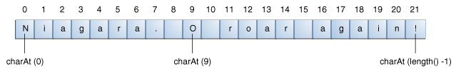

## 操作字符串中的字符

String类有很多方法来操作字符串中的内容，获取一个字符或者字符串的子串，转变大小写或者其他方法。

### 根据index获取字符或者子串

你可以使用charAt()方法来获取字符串中指定位置的字符。第一个字符的索引是0，最后一个字符的索引是length()-1，例如下面的代码获取index为9的字符：

```
String anotherPalindrome = "Niagara. O roar again!"; 
char aChar = anotherPalindrome.charAt(9);

```




索引从0开始，所以索引为9的字符是'O'.

如果你想得到一个字符串的子串，你可以使用substring()方法，这个方法有两个版本，如下所示：

|Method|Description|
|------|-----------|
|String substring(int beginIndex, int endIndex)|返回一个新的String，是原字符串的子串，从beginIndex(include)到endIndex(exclude)|
|String substring(int beginIndex)|返回一个新的String，是原字符串的子串，从beginIndex(include)到原字符串的末尾(include)。|


### 操作字符串的其他方法

|Method|Description|
|------|-----------|
|String[] split(String regex)|在字符串中寻找与指定的参数匹配的模式（正则表达式），并根据此模式将字符串进行切分，返回一个字符串数组，limit是可选参数，代表返回数组的最大长度|
|String[] split(String regex, int limit)||
|CharSequence subSequence(int beginIndex, int endIndex)|根据beginIndex(include)和endIndex(exclude)返回一个新的CharSequence|
|String trim()|返回去除头尾空格的新字符串，或者如果没有空格返回原字符串|
|String toLowerCase()|字符串中的字符全部装换为小写|
|String toUpperCase()|字符串中的字符全部装换为大写|


### 在字符串中寻找字符和子串

String类中还有其他的一些方法可以寻找字符和子串的位置。String类提供了寻找特定字符和子串在字符串中位置的方法：indexOf()和lastIndexOf()。indexOf方法从头开始搜寻，而lastIndexOf则从后往前查找。如果指定的字符或者子串没有找到，它们都会返回-1.

String类还提供了一个contains方法，判断一个字符串是否包含一个特定的字符序列，当你对子串在字符串中的位置不感兴趣而只需要知道是否包含时，可以使用此方法。


|Method|Description|
|------|-----------|
|int indexOf(int ch)|字符在字符串中的位置|
|int lastIndexOf(int ch)||
|int indexOf(int ch, int fromIndex)||
|int lastIndexOf(int ch, int fromIndex)||
|int indexOf(String str)||
|int lastIndexOf(String str)||
|int indexOf(String str, int fromIndex)||
|int lastIndexOf(String str, int fromIndex)||
|boolean contains(CharSequence s)||

** 注意，CharSequence是一个接口，Stir那个类实现了此接口，所以你可以给contains方法传一个String类型的参数。**


### 替换String中的字符或者子串

String类提供了很少的方法用来往一个字符串中插入字符或者另一个字符串。通常来说，你不会调用这些方法，你可以创建一个新的字符串，然后通过字符串连接操作，来构建你需要的字符串。

但是String类确实提供了以下4个方法：

|Method|Description|
|------|-----------|
|String replace(char oldChar, char newChar)|替换字符|
|String replace(CharSequence target, CharSequence replacement)|替换子串|
|String replaceAll(String regex, String replacement)|替换所有满足正则表达式的子串|
|String replaceFirst(String regex, String replacement)|替换第一个满足正则表达式的子串|

### 示例

下面的示例代码，Filename，使用lastIndexOf和substring方法分离文件名的不同部分，注意，Filename类中的方法并没有对参数进行校验，并假设参数是一个完整的路径名，并且带有文件名后缀。如果是生产环境的代码，要确保进行了参数校验。


```
public class Filename {
    private String fullPath;
    private char pathSeparator, 
                 extensionSeparator;

    public Filename(String str, char sep, char ext) {
        fullPath = str;
        pathSeparator = sep;
        extensionSeparator = ext;
    }

    public String extension() {
        int dot = fullPath.lastIndexOf(extensionSeparator);
        return fullPath.substring(dot + 1);
    }

    // gets filename without extension
    public String filename() {
        int dot = fullPath.lastIndexOf(extensionSeparator);
        int sep = fullPath.lastIndexOf(pathSeparator);
        return fullPath.substring(sep + 1, dot);
    }

    public String path() {
        int sep = fullPath.lastIndexOf(pathSeparator);
        return fullPath.substring(0, sep);
    }
}

public class FilenameDemo {
    public static void main(String[] args) {
        final String FPATH = "/home/user/index.html";
        Filename myHomePage = new Filename(FPATH, '/', '.');
        System.out.println("Extension = " + myHomePage.extension());
        System.out.println("Filename = " + myHomePage.filename());
        System.out.println("Path = " + myHomePage.path());
    }
}

And here's the output from the program:

Extension = html
Filename = index
Path = /home/user


```


** 注意，示例程序对文件名做了假设，如果文件名不带后缀，例如/use/share/data, 那么lastIndexOf('.')会返回-1。又或者文件名本身包含'.'，或者文件名最后一个字符是'.'，程序也可能不按预期执行**


