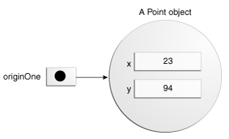
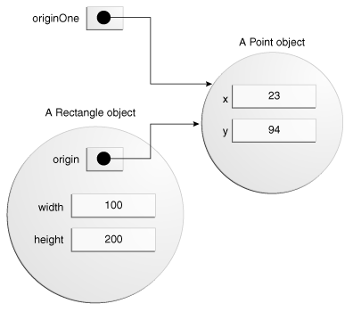

## Classes and Objects

根据你已经学习的java编程语言的基础知识，你可以学习编写你自己的类。在本章中，你将会学习定义自己的类，包括声明成员变量、方法和构造方法。你将会学习用你自己的类来创建对象，然后使用你创建的对象。这一章也会讲解内部类和枚举。

### Classes

面向对象编程概念一章以Bicycle类和各种子类为例介绍了面向对象的一些概念。下面是Bicycle类的一种可能的实现，这个类可以给你一个类定义的总览。接下去的章节将会逐步讲解类声明，现在，不必拘泥于细节：

```
public class Bicycle {
        
    // the Bicycle class has
    // three fields
    public int cadence;
    public int gear;
    public int speed;
        
    // the Bicycle class has
    // one constructor
    public Bicycle(int startCadence, int startSpeed, int startGear) {
        gear = startGear;
        cadence = startCadence;
        speed = startSpeed;
    }
        
    // the Bicycle class has
    // four methods
    public void setCadence(int newValue) {
        cadence = newValue;
    }
        
    public void setGear(int newValue) {
        gear = newValue;
    }
        
    public void applyBrake(int decrement) {
        speed -= decrement;
    }
        
    public void speedUp(int increment) {
        speed += increment;
    }
 }

```

Bicycle类的子类MountainBike类的声明可能如下：

```
public class MountainBike extends Bicycle {
        
    // the MountainBike subclass has
    // one field
    public int seatHeight;

    // the MountainBike subclass has
    // one constructor
    public MountainBike(int startHeight, int startCadence,
                        int startSpeed, int startGear) {
        super(startCadence, startSpeed, startGear);
        seatHeight = startHeight;
    }   
        
    // the MountainBike subclass has
    // one method
    public void setHeight(int newValue) {
        seatHeight = newValue;
    }   

}

```

MountainBike继承了Bicycle类的所有域，并且添加了域seatHeight和设置seatHeight的方法setHeight。


### 声明类

你已经见过如下形式的类声明：

```
class MyClass {
    // field, constructor, and 
    // method declarations
}

```
这是一个类声明。类的主体包括了从此类创建的对象的生命周期的所有代码：构造方法用来初始化对象，域提供了类和对象的状态，方法实现了类和对象的行为。

上面的类声明是一种最简单的形式，它仅仅包含了类声明必须的组件。你还可以提供有关类的更多的信息，你可以在类定义的开始部门提供需要继承的父类的名字、此类是否实现了特定的接口等等，例如：

```
class MyClass extends MySuperClass implements YourInterface {
    // field, constructor, and
    // method declarations
}

```

上述代码表示MyClass是MySuperClass的子类，并且实现了YourInterface接口。

你也可以在类声明的开始加上public或者private修饰符，所以一个类的完整声明可能会非常复杂。修饰符public和private，决定了其他类是否可以访问MyClass类，会在本章的后半部分详细讨论。关于接口和继承的教程将会解释为什么以及怎样在类声明中使用extends和implements关键字。

通常，类声明以下5部分，依次如下：

* 修饰符，例如public、private，还要其他的修饰符后续会遇到
* 类名，根据惯例，首字母大写
* 继承的父类名，在extends关键字后，java仅支持单继承
* 实现的接口名，在implements关键字后，支持实现多个接口，用逗号隔开
* 类主体代码，在{}中


### 成员变量声明

java编程语言中有几种不同的变量：

* 类中的成员变量：称为域
* 方法或者代码块中的变量：称为局部变量
* 方法声明中的变量：称为参数

Bicycle类中用如下几行代码定义它的域：

```
public int cadence;
public int gear;
public int speed;

```

域声明由如下三部分组成，依次为：

* 0个或多个修饰符，例如public或者private
* 域的类型
* 域的名字

Bicycle类的域的名字为cadence、gear和speed，这三个域的类型都是int，public修饰符表示这些域是公共的成员，任意可以访问此类的对象都可以访问这些成员。

##### 访问修饰符

开头的修饰符可以让你控制其他类对一个成员域的访问权限。当前，我们只讨论public和private，其他修饰符以后讨论。

* public修饰符：此域可以被所有的类访问
* private修饰符：此域仅在本类内部可访问

本着封装的精神，通常将域设置为private。这表明它们仅仅可以在Bicycle类内部直接使用，但是，我们仍然需要访问这些域，否则所有的域无法访问，那此类没有存在的意思。这可以通过提供公共的方法来实现：

```
public class Bicycle {
        
    private int cadence;
    private int gear;
    private int speed;
        
    public Bicycle(int startCadence, int startSpeed, int startGear) {
        gear = startGear;
        cadence = startCadence;
        speed = startSpeed;
    }
        
    public int getCadence() {
        return cadence;
    }
        
    public void setCadence(int newValue) {
        cadence = newValue;
    }
        
    public int getGear() {
        return gear;
    }
        
    public void setGear(int newValue) {
        gear = newValue;
    }
        
    public int getSpeed() {
        return speed;
    }
        
    public void applyBrake(int decrement) {
        speed -= decrement;
    }
        
    public void speedUp(int increment) {
        speed += increment;
    }
}

```

##### 类型

所有的变量都必须有一个类型。你可以使用基本数据类型int，float，boolean等。你也可以使用引用类型，例如String、Array或者Object。

##### 变量名

所有的变量，不管是域、局部变量或者参数，都遵循同样的命名规则，前面的章节曾提到过变量的命名规则。

本章中，注意，以前的命名规则同样适用，除了以下两点：

* 类名的首字母要大些
* 方法名的第一个单词应该是动词


### 定义方法

下面是一个典型的方法定义的例子：

```
public double calculateAnswer(double wingSpan, int numberOfEngines, double length, double grossTons) {
    //do the calculation here
}

```

方法定义所必需的几个元素为：返回值、方法名、()、{}。通常，方法定义包括以下6部分：

* 修饰符：例如private、public等
* 返回值：基本数据类型、引用数据类型、void
* 方法名：遵循一定的命名规则
* 参数列表：在小括号中列出，以逗号隔开
* 异常列表：后续讨论
* 方法体：方法实现代码，在一对大括号中

** 上述6个元素中的2个，唯一组成了方法的签名，它们是方法名和参数列表 **

##### 方法名

尽管方法名可以是任意合法的标识符，但是命名规则对方法名有一定的限制。根据惯例，方法名应该以动词开头，跟上形容词、名字等，并符合驼峰命名法。下面是一些方法名示例：

```
run
runFast
getBackground
getFinalData
compareTo
setX
isEmpty

```
通常，一个方法在类内部有唯一的名字，但是由于重载机智，一个类中也可能有几个同名的方法。


##### 方法重载

java编程语言支持方法重载，java根据方法签名（方法名和参数列表）来区分不同的方法。这意味着，一个类中的几个方法可以有相同名字，只要它们的参数列表不完全相同即可。

假设你有一个类，这个类可以使用笔迹画出各种类型的数据，这个类拥有画每种数据类型的方法。如果为每一个方法都起一个新名字会很繁琐，例如drawString, drawInteger, drawFloat等。在java编程语言中，你可以为所有的方法使用同一个名字，但是传递不同的参数。因此，这个类可以声明4个同名的方法，每个方法都有不同的参数列表：

```
public class DataArtist {
    ...
    public void draw(String s) {
        ...
    }
    public void draw(int i) {
        ...
    }
    public void draw(double f) {
        ...
    }
    public void draw(int i, double f) {
        ...
    }
}

```

方法重载根据方法的参数个数和类型来区分不同的方法。上面的示例代码中，draw(String s) 和draw(int i)是不同的方法，因为它们有不同的参数类型。当区分方法时，编译器不会参考方法返回值，所以，你不能定义多个方法签名完全相同但返回值不同的方法。

** 方法重载要保守的使用， 因为它降低了代码的可读性。 **


### 给类提供构造方法

构造方法是类用来创建对象的特殊方法。构造方法的声明类似于普通方法声明，但是它们没有返回值，并且方法名和类名完全相同。例如，Bicycle类有如下构造方法：

```
public Bicycle(int startCadence, int startSpeed, int startGear) {
    gear = startGear;
    cadence = startCadence;
    speed = startSpeed;
}

```

为了创建一个Bicycle类的实例，需要使用new操作符，如下所示：

```
Bicycle myBike = new Bicycle(30, 0, 8);

```

new Bicycle(30, 0, 8)为对象在内存中创建了存储空间，并且初始化了对象的各个域。尽管Bicycle只有一个构造方法，但是它可以有多个，甚至可以有无参的构造方法：

```
public Bicycle() {
    gear = 1;
    cadence = 10;
    speed = 0;
}

```

Bicycle类可以同时拥有上述的两个构造方法，因为它们的参数不同。java编程语言根据它们的参数列表和类型区分不同的构造方法。

你可以不给类编写任何的构造方法，但是如果这样做，你需要加倍小心。对于没有显示编写构造方法的类来说，编译器会自动提供一个无参的默认构造方法。这个默认的构造方法会调用父类的无参构造方法，这种情况下，如果父类没有一个无参构造方法，编译器将会报错。如果你的类没有显示的继承其他类，那么它拥有一个隐式的父类--Object，Object类有无参的构造方法。

你也可以自己调用父类的构造方法，MountainBike类就这样做了。这方面的知识将在接口和继承一章进行讨论。你可以使用访问修饰符来修饰构造方法，来控制其他类访问构造方法的权限。

** 如果一个类不能调用MyClass的构造方法，它不能显示的创建MyClass的对象。 **


### 向方法和构造方法传递信息

方法和构造器声明了参数的类型和数量。下面的方法计算家庭贷款的利息，参数有贷款的数量、利率、贷款时间长度、未来的贷款数量：

```
public double computePayment(double loanAmt, double rate, double futureValue, int numPeriods) {
    double interest = rate / 100.0;
    double partial1 = Math.pow((1 + interest), 
                    - numPeriods);
    double denominator = (1 - partial1) / interest;
    double answer = (-loanAmt / denominator)
                    - ((futureValue * partial1) / denominator);
    return answer;
}

```

上述方法有4个参数，其中前三个类型为double，第四个参数类型为int。参数的值将在运行期间被方法内部所使用。

** Parameters是方法定义时的参数列表，称为形参；Arguments是实际调用方法时真正传入的值，是在运行中会使用的值，称为实参。 **

##### 参数类型

方法的参数类型可以试任意的数据类型，包括基本数据类型（int，float，char等）和引用数据类型（数组、对象）。例如：

```
public Polygon polygonFrom(Point[] corners) {
    // method body goes here
}

```

** 如果你向方法的参数传递了另一个方法，称为lambda表达式或者方法引用 **


##### 任意数量的参数

你可以使用一个结构，称为可变参数，来想一个方法传递任意数量的参数。当你不确定要给方法传递多少个参数时，你可以使用可变参数。它其实是一种手动创建数组的简写方式。

如果想使用可变参数，你要在方法的最后一个参数的类型后面加上三个点(...)，然后是空格，然后是参数名。然后，这个方法在调用时就可以传递任意数量的参数，甚至不传参数。

```
public Polygon polygonFrom(Point... corners) {
    int numberOfSides = corners.length;
    double squareOfSide1, lengthOfSide1;
    squareOfSide1 = (corners[1].x - corners[0].x)
                     * (corners[1].x - corners[0].x) 
                     + (corners[1].y - corners[0].y)
                     * (corners[1].y - corners[0].y);
    lengthOfSide1 = Math.sqrt(squareOfSide1);

    // more method body code follows that creates and returns a 
    // polygon connecting the Points
}

```

正如你所看到的，在方法的内部，corners参数被当做数组来操作。这个方法在被调用时，可以传递一个参数序列或者一个数组，方法内部都会把参数当做数组来对待。

最常见的使用可变参数的方法时printing方法，例如printf方法：

```
public PrintStream printf(String format, Object ... args) 

```

调用此方法示例： 

```
System.out.printf("%s: %d, %s%n", name, idnum, address);
System.out.printf("%s: %d, %s, %s, %s%n", name, idnum, address, phone, email);

```


##### 参数名

当你为方法声明一个参数时，你需要提供参数名。这个参数名会在方法内部使用，指向传入的参数。参数名必须在有效范围内唯一。同一个方法的参数名不能相同，方法参数名不能与方法内部声明的局部变量名相同。

参数名可以与类的域的名字相同。在这种情况下，我们说参数隐蔽了域。隐蔽域使你的代码更不易读，通常只用在普通方法和构造方法中，用来设置域值。例如：

```
public class Circle {
    private int x, y, radius;
    public void setOrigin(int x, int y) {
        ...
    }
}

```

Circle类有3个域：x，y，和radius。setOrigin方法有两个参数，每一个都与域同名。每一个参数都隐蔽了同名的域。所以，如果在方法内部简单的使用x和y，此时的x和y指的是参数，而不是域。为了访问x和y域，则需指定一个特殊的名字，后面的章节将介绍如何使用this关键字。

##### 传递基本数据类型参数

基本数据类型参数，比如int或者double，是以值传递的方式传到方法中的。这表示任何对参数的修改只会在方法内部范围生效，当方法返回后，参数消失，任何对参数的修改也消失了。例如：

```
public static void main(String[] args) {
           
        int x = 3;
           
        // invoke passMethod() with 
        // x as argument
        passMethod(x);
           
        // print x to see if its 
        // value has changed
        System.out.println("After invoking passMethod, x = " + x);
           
    }
        
    // change parameter in passMethod()
    public static void passMethod(int p) {
        p = 10;
    }
}
When you run this program, the output is:

After invoking passMethod, x = 3

```

##### 传递引用类型参数

传递引用数据类型，例如对象或数组，也是通过值传递的方式。这表明，当方法返回后，传递的引用还是指向原来的对象。但是，原来对象的域可能会被方法改变，如果这些域可以被访问到的话。示例代码如下：

```
public void moveCircle(Circle circle, int deltaX, int deltaY) {
    // code to move origin of circle to x+deltaX, y+deltaY
    circle.setX(circle.getX() + deltaX);
    circle.setY(circle.getY() + deltaY);
        
    // code to assign a new reference to circle
    circle = new Circle(0, 0);
}

```

如果执行如下的方法调用：moveCircle(myCircle, 23, 56)；在方法的内部，circle最开始引用myCircle，方法内部改变了circle对象的x和y坐标。这些变化将会保留下来，即使方法返回了。然后circle被赋值了另一个新的Circle对象，它的x和y坐标都为0。这次赋值的影响并不会长久的保持，因为引用是值传递，是不可改变的。在方法内部，circle指向的对象变了，但是，当方法返回时，myCircle仍然指向原先的Circle对象，而不是指向x和y都为0的新Circle对象，这点需要特别注意，<b>java中没有引用传递！！！</b>


## 对象

一个典型的java程序会创建很多对象，你已经知道了，通过调用方法的形式。通过这些对象之间的交互，程序可以完成各种各样的任务。例如，实现一个用户图像界面，运行一个动画，通过网络收发信息等。一旦一个对象完成了分配给它的工作，它占用的资源将会被回收，然后被其他对象使用。下面的小程序创建了3个对象。

```
public class CreateObjectDemo {

    public static void main(String[] args) {
		
        // Declare and create a point object and two rectangle objects.
        Point originOne = new Point(23, 94);
        Rectangle rectOne = new Rectangle(originOne, 100, 200);
        Rectangle rectTwo = new Rectangle(50, 100);
		
        // display rectOne's width, height, and area
        System.out.println("Width of rectOne: " + rectOne.width);
        System.out.println("Height of rectOne: " + rectOne.height);
        System.out.println("Area of rectOne: " + rectOne.getArea());
		
        // set rectTwo's position
        rectTwo.origin = originOne;
		
        // display rectTwo's position
        System.out.println("X Position of rectTwo: " + rectTwo.origin.x);
        System.out.println("Y Position of rectTwo: " + rectTwo.origin.y);
		
        // move rectTwo and display its new position
        rectTwo.move(40, 72);
        System.out.println("X Position of rectTwo: " + rectTwo.origin.x);
        System.out.println("Y Position of rectTwo: " + rectTwo.origin.y);
    }
}

```

这个程序创建，操作并展示了多个对象的信息。接下去的三节教程将使用上述的程序描述对象的生命周期，你将会学习如何创建和使用对象，你也会学习系统怎样在一个对象生命周期结束的时候清除此对象。

##### 创建对象

你已经知道，类提供了对象的蓝图，你从类可以创建一个对象。如下所示，每行代码均创建了一个对象：

```
Point originOne = new Point(23, 94);
Rectangle rectOne = new Rectangle(originOne, 100, 200);
Rectangle rectTwo = new Rectangle(50, 100);

```

第一行创建了一个Point对象，第二行和第三行各创建了一个Rectangle对象。

每一个语句包括3部分：

* 声明：声明一个与特定类型对象关联的变量
* 实例化：new关键词是java用来创建对象的操作符
* 初始化：new操作符可以调用构造方法，构造方法用来初始化一个新对象


##### 声明一个变量，指向一个对象

前面已经接触了如何声明一个变量：type name;这个语句告诉编译器，你将会使用name变量指向一个类型为type的对象。对于基本数据类型变量，这个声明会同时为变量保存适当的内存空间。

你可声明一个引用类型的变量，Point originOne; 如果你使用如上代码声明一个变量，它的值暂时不确定，直到一个对象被创建并且分配给此变量。简单的声明一个引用类型的变量并不会创建一个新对象。为了创建对象，你必须使用new操作符。在使用originOne变量之前，你必须给它分配一个对象，否则编译器会报错。

##### 实例化一个类

new操作符通过为一个新对象申请内存，并返回指向那个内存的一个引用来实例化一个类。new操作符同时会调用构造方法。

** 短语“实例化一个类”与创建一个对象是同一个意思。当你创建一个对象时，你创建了类的一个实例，因此也称为实例化一个类 **

new操作符需要一个单一的、后置的参数，称为构造函数。构造函数的名字提供了要实例化的类的名字。new操作符返回指向已创建的对象的引用，这个引用通常被分配给一个变量，例如：

```
Point originOne = new Point(23, 94);

```

但是，这个引用也不一定非要分配给一个变量，它可以直接在表达式中使用，例如：

```
int height = new Rectangle().height;

```

##### 初始化一个对象

Point类的代码如下：

```
public class Point {
    public int x = 0;
    public int y = 0;
    //constructor
    public Point(int a, int b) {
        x = a;
        y = b;
    }
}

```
Point类仅有一个构造方法。你可以识别出这个构造方法，因为它的名字和类名一致并且没有返回值。这个构造方法接受两个int参数，调用语句例如：

```
Point originOne = new Point(23, 94);

```
这条语句执行之后的结果可以由下图描述：




Rectangle类的代码如下所示，它有4个构造方法：

```
public class Rectangle {
    public int width = 0;
    public int height = 0;
    public Point origin;

    // four constructors
    public Rectangle() {
        origin = new Point(0, 0);
    }
    public Rectangle(Point p) {
        origin = p;
    }
    public Rectangle(int w, int h) {
        origin = new Point(0, 0);
        width = w;
        height = h;
    }
    public Rectangle(Point p, int w, int h) {
        origin = p;
        width = w;
        height = h;
    }

    // a method for moving the rectangle
    public void move(int x, int y) {
        origin.x = x;
        origin.y = y;
    }

    // a method for computing the area of the rectangle
    public int getArea() {
        return width * height;
    }
}

```

每一个构造方法都会让你初始化origin、width、height域，使用基本数据类型或者引用数据类型。如果一个类有多个构造方法，它们必须有不同的签名。java编译器根据参数的个数和类型来区分不同的构造方法。当java编译器遇见如下的语句时，它知道调用需要一个Point类型和两个int类型的参数的构造方法。

```
Rectangle rectOne = new Rectangle(originOne, 100, 200);

```

上述语句，会将origin域初始化为originOne，同时，这个构造方法将width设置为100，将height设置为200。现在有两个引用指向同一个Point对象--一个对象可以有多个引用，如下图所示。



下面的代码调用有两个int型参数的构造方法，这两个参数将会为width何height域提供初始值。
如果你跟踪构造方法的执行，你将会发现它同时创建了一个Point对象，并将Point对象的x和y域设置为0.

```
Rectangle rectTwo = new Rectangle(50, 100);

```

下面的构造方法不需要任何的参数，称为无参构造方法。

```
Rectangle rect = new Rectangle();

```

所有的类至少有一个构造方法，如果一个类没有显示的指定构造方法，编译器会提供一个无参构造方法，称为默认构造方法。这个默认的构造器会调用父类的无参构造器，如果父类没有无参构造器，编译器会报错。


##### 使用对象

一旦你创建了一个对象，你使用它做某些事情。你可能需要使用它的某个域的值，改变它的域，或者调用它的方法来执行某些动作。

##### 引用一个对象的域

对象的域通过名字来进行访问，你必须使用一个无二义性的名字。你可以在类内部使用简单的名字来引用域，例如：System.out.println("Width and height are: " + width + ", " + height); 类之外的代码则必须使用一个对象引用或者表达式，后面跟上点操作符(.)，然后跟上域的名字，比如：objectRederence.fieleName.

举个例子，CreateObjectDemo类是在Rectangle类的外部，因此，为了引用Rectangle类的对象的域，CreateObjectDemo类必须使用rectOne.origin, rectOne.width等。在CreateObjectDemo类中直接使用origin、width或者height这些简单的域名没有任何意义并且编译也通不过，因为这些域是存在于某个特定的对象之中的。

```
System.out.println("Width of rectOne: "  + rectOne.width);
System.out.println("Height of rectOne: " + rectOne.height);

```

同一类型的不同对象各有一份相同实例变量的拷贝。因此，每一个Rectangle都包括域：origin, width，height。当你通过对象引用访问域的时候，你指的是特定对象的域。CreateObjectDemo程序中的rectOne和rectTwo这两个对象有不同的origin, width和height域。

为了访问某个域，你需要指向某个对象的引用，或者使用任何返回对象引用的表达式。new操作符会返回一个对象的引用，因此你可以使用new操作符返回的对象引用来访问这个对象的域：

```
int height = new Rectangle().height;

```

这个语句创建了一个新的Rectangle，并且马上访问了它的height域。我们注意到，当这个语句执行后，程序中不再有指向创建的Rectangle对象的引用，因为程序没有在任何地方存储这个引用。这个对象随后变得无法访问，然后它的资源会被JVM进行回收再利用。


##### 调用对象的方法

你可以使用对象的引用来调用一个对象的方法。将方法名添加到对象引用的后面，中间插入一个点操作符(.)，同时，你可以在小括号内传入参数列表。如果方法不需要任何参数，则使用空的括号即可。

```
objectReference.methodName(argumentList); // 传递参数
objectReference.methodName(); // 无参方法

```

Rectangle类有两个方法：getArea()方法计算rectangle的面积，move()方法改变rectangle的端点。CreateObjectDemo类调用了这两个方法：

```
System.out.println("Area of rectOne: " + rectOne.getArea());
...
rectTwo.move(40, 72);


```

第一个语句调用了rectOne的getArea()方法，并打印出了返回值。第二个语句移动了rectTwo对象，因为move()方法改变了rectTwo的x和y域。


对于实力域来说，objectReference必须是对象的一个引用。你可以用一个变量，或者一个返回对象引用的表达式。new操作符返回对象的引用，所以你可以使用new操作符返回的对象引用来调用对象的方法：

```
new Rectangle(100, 50).getArea();

```

一些方法具有返回值，比如getArea()。对于具有返回值的方法，你可以在表达式中调用方法，你可以把返回值赋值给一个变量，使用此变量做决策、或控制循环体。记住，调用一个特定对象的方法，跟给对象发信息是一样的道理。

##### 垃圾收集器

有些面向对象编程语言需要你记录所有创建的对象，并在不需要使用这些对象的时候显示的释放它们。显示的管理内存是一件繁琐且容易出错的事。java平台允许你创建任意多(只要你的系统可以处理这么多对象)的对象，你不必担心对象销毁问题。java运行时环境会在发现对象不再使用之后自从删除它们。这个过程称为垃圾收集。


一个对象在没有任何的引用指向它的时候，它具备了被回收的资格。变量持有的引用通常在它们超出有效范围之后就丢弃了。或者，你可以通过把变量赋值为特殊的值--null，来显示的丢弃一个对象引用。记住，一个程序可能会有对同一个对象的很多引用，在次对象被回收之前，所有的引用都必须被丢弃。


java运行时环境包括一个垃圾收集器，它可以定时的释放那些不需要再使用的对象占有的内存空间，垃圾收集器会在它认为合适的时间自动的进行工作。


### More On CLasses

这一节会在上一节介绍的知识基础上，覆盖更多有关类的概念：

* 方法的返回值
* this关键字
* 类成员 vs 实例成员
* 访问控制


##### 方法返回value

一个方法会在如下几种情况下返回，取决于三者发生的先后：

* 完成了所有的语句，正常退出
* 执行到了return语句
* 抛出异常
 

你在方法声明中声明了方法的返回值类型，在方法体中，你使用return语句来返回对应的值。返回值为void的方法返回任何值，它不必包括return语句，但你确实可以在方法体中使用return语句。在这种情况下，return语句可以跳出控制流，结束方法。如果你试图为声明了返回值为void的方法，返回其他的值，编译器会报错。

示例代码getArea()方法返回一个基本数据类型。一个方法还可以返回引用数据类型。

```
// a method for computing the area of the rectangle
    public int getArea() {
        return width * height;
    }
    
 // 返回引用数据类型  
public Bicycle seeWhosFastest(Bicycle myBike, Bicycle yourBike, Environment env) {
    Bicycle fastest;
    // code to calculate which bike is 
    // faster, given each bike's gear 
    // and cadence and given the 
    // environment (terrain and wind)
    return fastest;
}

```

##### 返回类或者接口

当一个方法使用类名来作为它的返回值，那么方法返回的对象必须是此类或者其子类的实例。假设我们有如下的类层级结构。


有一个方法返回值为Number，如下所示：

```
public Number returnANumber() {
    ...
}

```

则方法的返回值可以是ImaginaryNumber类的实例但不能是Object类的实例。ImaginaryNumber类是Number类的子类，但是，Object不一定是Number，它有可能是String或者任意其他类型。

你可以覆盖一个方法，将它的返回值改为被覆盖方法返回值的子类型，例如：

```
public ImaginaryNumber returnANumber() {
    ...
}

```

这个技术，称为协变返回类型，意思是返回类型可以在子类中向同一方向改变（可以这样理解，方法覆盖的场景仅发生在父类和子类之间，SubClass是SupClass的子类，那么当SubClass的returnANumber方法覆盖SupClass的returnANumber方法时，它的返回值也可以是SupClass的returnANumber方法返回值的子类，称为协同改变）。

** 你也可以将一个接口名作为返回值，在这种情况下，返回的对象必须实现特定的接口 **


### 使用this关键字

在一个实例方法或者构造器中，this关键字是指向当前对象的一个引用--当前对象指正在被调用的方法或者构造器所属的对象。你可以在实例方法和构造器中使用this关键字来访问当前对象的任意成员。

##### 使用this访问域

最常见的使用this的场景是一个域被方法或者构造器的参数隐蔽了。

```
public class Point {
    public int x = 0;
    public int y = 0;
        
    //constructor
    public Point(int a, int b) {
        x = a;
        y = b;
    }
}

// 使用this关键字访问当前对象的域
public class Point {
    public int x = 0;
    public int y = 0;
        
    //constructor
    public Point(int x, int y) {
        this.x = x;
        this.y = y;
    }
}

```

##### 在构造器中使用this

在构造器中，你可以使用this关键字来调用同一个对象的其他构造器。这成为显示构造器调用。示例代码：

```
public class Rectangle {
    private int x, y;
    private int width, height;
        
    public Rectangle() {
        this(0, 0, 1, 1);
    }
    public Rectangle(int width, int height) {
        this(0, 0, width, height);
    }
    public Rectangle(int x, int y, int width, int height) {
        this.x = x;
        this.y = y;
        this.width = width;
        this.height = height;
    }
    ...
}

```

这个类有3个构造器。每个构造器初始化了一些或者全部的成员变量。如果在构造器中使用this关键字调用另一个构造器，那么这行调用代码必须位于第一行，否则编译器会报错。


### 类成员的访问控制

访问级别修饰符决定了其他类是否可以使用一个特定的域或者调用一个特定的方法。有两种级别的访问控制：

* top-level：public或者package-private（如果不指定修饰符，默认为包访问级别）
* 成员级别：public、private、protected、package-private

一个类定义的时候可以使用public修饰符，在这种情况下，这个类对其他所有类都是可见的。如果一个类定义的时候没有指定访问控制修饰符，它默认是包访问控制的，也就是说跟它在同一个package下的所有类都可以访问它。


对于成员级别级别的访问控制，你可以使用类似于top-level的public和package-private访问级别，你也可以使用另外两种访问控制修饰符：private和protected。private修饰符表面这个成员仅可以在类内部进行访问。protected修饰符表明这个成员仅可以在包内（package-private）和在其他包中的子类中进行访问。下面的表格说明了各访问修饰符的控制级别：

|Modifier|Class|Package|Subclass|World|
|--------|-----|-------|--------|-----|
|public| Y | Y | Y| Y |
|protected| Y | Y | Y | N|
|no modifier | Y | Y | N | N |
|private| Y | N | N | N |


访问级别会以两种方式影响你。第一，当你使用其他第三方类的时候，比如jav平台提供的类，访问级别决定了你的类可以访问哪些第三方类的成员。第二，当你编写自己的类时，你需要考虑每个成员变量和方法应该使用哪种访问级别。


根据上面的图片，下面的表格展示了不同访问控制修饰符修饰的Alpha类的变量对其他类的可见性。

|Modifier|Alpha|Beta|Alphasub|Gamma|
|--------|-----|----|--------|-----|
|public| Y | Y | Y | Y |
|protected| Y | Y | Y | N |
|no modifier| Y | Y | N | N |
|private| Y | N | N | N |


如果有其他程序员使用你的类，访问控制修饰符会帮你做如下的事情：

* 使用最严格的访问级别，除非你有好的理由，否则首先考虑使用private
* 对于域，避免使用public修饰符，除非是常量域。public修饰的域倾向于将你和特定的实现关联起来，限制了你修改代码的灵活性。


### 理解类成员

这一节，我们将会讨论使用static关键字创建属于类而不是属于类实例的域和方法。

##### 类变量

当很多对象都从一个蓝图创建出来的时候，它们各自保有实例变量的一份拷贝。在Bicycle类中，实例变量是cadence、gear、和speed。每个Bicycle对象的这3个变量都有自己的值，存储在不同的内存位置。

有时，你想要对于所有对象都一样的变量。这可以通过static关键字实现。用static关键字修饰的变量称为静态域或类变量。它们与类有关，与具体的对象无关。类的所有对象都共享类变量，这些类变量都存储在同一内存位置。任何对象都可以改变类变量，但是在不创建任何对象的情况下，类变量仍然可以被修改。

例如，假设你想要创建很多Bicycle对象，并且为每个对象分配一个序列号，从1开始。这个ID对于每个对象都是唯一的，所以它必须声明为实例变量。同时，你需要一个域来记录总共创建了多少个对象，只有这样，你才知道应该分配给下个对象的ID。这个域与具体的每个对象是无关的，仅与类有关。所以，你需要一个类变量，numberOfBicycles,如下所示：

```
public class Bicycle {
        
    private int cadence;
    private int gear;
    private int speed;
        
    // add an instance variable for the object ID
    private int id;
    
    // add a class variable for the
    // number of Bicycle objects instantiated
    private static int numberOfBicycles = 0;
        ...
}

```

类变量可以通过Bicycle.numberOfBicycles来进行访问，这样的访问方式也说明了numberOfBicycles是类变量。

** 你也可以通过一个对象来访问静态域，例如：myBike.numberOfBicycles，但是，我们不推荐这种方式，因为它没有明确的表明numberOfBicycles变量是一个类变量。

你可以在构造器中初始化实例变量id，并且对类变量numberOfBicycles执行自增操作：

```
public class Bicycle {
        
    private int cadence;
    private int gear;
    private int speed;
    private int id;
    private static int numberOfBicycles = 0;
        
    public Bicycle(int startCadence, int startSpeed, int startGear){
        gear = startGear;
        cadence = startCadence;
        speed = startSpeed;

        // increment number of Bicycles
        // and assign ID number
        id = ++numberOfBicycles;
    }
  
    // new method to return the ID instance variable
    public int getID() {
        return id;
    }
        ...
}


```

##### 类方法

java编程语言也支持静态方法。静态方法，当声明的时候需要使用修饰符static，调用的时候使用类名调用，无需创建对象：ClassName.methodName(args)

** 你也可以通过对象来访问静态方法，但是不鼓励这么做，因为它没有明确的表明一个方法是静态方法 **

一个常见的使用static方法的场景是为了访问static变量，比如，为了访问静态变量numberOfBicycles，我们需要给Bicycle类添加一个静态方法：

```
public static int getNumberOfBicycles() {
    return numberOfBicycles;
}

```

实例方法和类方法以及实例变量和类变量之间的相互访问是有限制的：

* 实例方法可以访问实例变量，调用实例方法
* 实例方法可以访问类变量和类方法
* 类方法可以访问类变量和类方法
* 类方法不能直接访问实例变量和实例方法，它们必须使用一个对象引用。同时，类方法不能使用this关键字，因为这时候没有实例供其引用。

##### 常量

static修饰符和final修饰符一起，可以定义常量。final修饰符表明这个域的值是不可以改变的。下面的代码，定义了常量PI：

```
static final double PI = 3.141592653589793;

```

以上述形式定义的常量是不可以再次赋值的，如果尝试再次赋值，编译器会报错。通常，常量的名字全部使用大写字谜，单词之间以下划线隔开。

** 如果常量的类型是基本数据类型或者字符串，并且编译时就已经知道它的值，编译器会把常量所在的位置都替换成对应的值。这称为编译时常量。如果常量值需要改变，你需要重新编译你的类，以获取新的常量值。

##### Bicycle类

经过本节的改变，Bicycle类现在代码：

```
public class Bicycle {
        
    private int cadence;
    private int gear;
    private int speed;
        
    private int id;
    
    private static int numberOfBicycles = 0;

        
    public Bicycle(int startCadence, int startSpeed, int startGear) {
        gear = startGear;
        cadence = startCadence;
        speed = startSpeed;

        id = ++numberOfBicycles;
    }

    public int getID() {
        return id;
    }

    public static int getNumberOfBicycles() {
        return numberOfBicycles;
    }

    public int getCadence() {
        return cadence;
    }
        
    public void setCadence(int newValue) {
        cadence = newValue;
    }
        
    public int getGear(){
        return gear;
    }
        
    public void setGear(int newValue) {
        gear = newValue;
    }
        
    public int getSpeed() {
        return speed;
    }
        
    public void applyBrake(int decrement) {
        speed -= decrement;
    }
        
    public void speedUp(int increment) {
        speed += increment;
    }
}

```

### 初始化域

你可以看到，你总是可以在声明一个域的同时给它赋一个初始值：

```
public class BedAndBreakfast {

    // initialize to 10
    public static int capacity = 10;

    // initialize to false
    private boolean full = false;
}

```

当确定初始值的时候，这种方式简单，而且可以一行代码完成。但是，正因为这种初始化方式太简单，它有一定的限制。如果初始化的时候需要执行一些逻辑（例如，错误处理、利用for循环填充数组等），简单的赋值是不足以应付的。实例变量可以在构造函数中初始化。而类变量则需要在静态块中初始化。

** 在类的开始部分就声明域不是必需的，尽管这是常见的做法。只有一点是必须的，就是在变量被使用之前，它必须先被声明和初始化。**

##### 静态初始化块

一个静态初始化块是包含在开闭的{}中的一个普通的代码块，在{}的前面需要添加static关键字，例如：

```
static {
    // whatever code is needed for initialization goes here
}

```

一个类可以有很多静态代码块，而且它们可以出现在类的任何地方。系统会保证静态块按照它们在源代码中的顺序执依次行。你可以写一个私有的静态方法来完成和静态块同样的任务：

```
class Whatever {
    public static varType myVar = initializeClassVariable();
        
    private static varType initializeClassVariable() {

        // initialization code goes here
    }
}

```

私有静态方法的优势是如果你想重新初始化类变量的时候，它可以重用。

##### 初始化类成员

通常，你会在构造器中初始化实例变量。除此之外，还有两种方式：初始化块和final方法。

初始化块类似于静态块，但是没有static关键字作为前缀，java编译器会把每个初始化块放入每一个构造方法中。因此，这种方法可以在多个构造方法之间共享同一段代码。

```
{
    // whatever code is needed for initialization goes here
}

```

final方法不能被紫烈覆盖。final关键字将会在接口和继承一章讨论。使用final方法初始化实例变量的示例如下：

```
class Whatever {
    private varType myVar = initializeInstanceVariable();
        
    protected final varType initializeInstanceVariable() {

        // initialization code goes here
    }
}


```

如果子类想要重用初始化方法，这种方式非常合适。方法被定义为final的，这是因为如果在实例初始化的时候调用非final方法，可能会引起问题。


### 嵌套类

java编程语言允许你在一个类的内部定义另一个类，这个内部定义的类称为嵌套类：

```
class OuterClass {
    ...
    class NestedClass {
        ...
    }
}

```

** 术语：嵌套类分为两种：静态和非静态。声明时加static关键字的嵌套类称为静态嵌套类，非静态的嵌套类称为内部类。 **

```
class OuterClass {
    ...
    static class StaticNestedClass {
        ...
    }
    class InnerClass {
        ...
    }
}

```

嵌套类是外部类的一个成员。非静态嵌套类（内部类）可以访问外部类的其他成员，即使它们是private的。静态内部类不能访问外部的成员。作为外部类的一个成员，一个嵌套类可以声明为private、public、protected或者package private。


##### 为什么使用嵌套类

使用嵌套类的理由有如下：

* 仅在一个地方、在逻辑上组织一组类的一种方式：如果一个类仅对另一个类是有用的，那么在逻辑上应该把这个类嵌套在另一个类中，将二者结合在一起。嵌套这种“helper class”使你的包组织的更合理。
* 它增强了封装性：考虑两种顶级类：A和B。B需要访问A的成员，而这个成员可能在A中声明为private的。通过将B嵌套在A内部，A的成员可以声明为private的，同时B也可以访问这些成员。除此之外，对外部来说，B自己也是不可见的。
* 增强代码的可读性和可维护性：在顶级类中嵌套小的类，可以将代码放在它被使用的更近的地方。


##### 静态嵌套类

像静态方法和静态变量一样，一静态嵌套类与外部类是联系在一起的。静态嵌套类不能直接访问外部类的实例变量或者实例方法：它只可以通过对象的引用来访问实例方法和变量。

** 一个静态嵌套类就像其他外部类一样与包含它的外部类进行交互。实际上，一个静态嵌套类表现的就跟一个普通顶级类嵌入另一个顶级类中一样。嵌套的目的是为了更好地组织包结构。**

静态嵌套类可以通过外部类来访问：

```
OuterClass.StaticNestedClass

```

例如，创建一个静态嵌套类的实例，需要语法：

```
OuterClass.StaticNestedClass nestedObject = new OuterClass.StaticNestedClass();

```

##### 内部类

就像实例方法和实例变量那样，一个内部类和一个外部类的实例是联系在一起的，内部类可以直接访问这个实例的方法和域。同时，因为内部类是与一个对象联系在一起的，他不能定义任何的静态成员。

内部类的实例存在于外部类的实例之中，考虑下面的内部类：

```
class OuterClass {
    ...
    class InnerClass {
        ...
    }
}

```

InnerClass的一个实例仅可以存在于OuterClass的一个实例之中，并且可以访问OuterClass实例的方法和域。为了实例化一个内部类，你必须首先实例化外部类。然后，使用外部类的对象来创建内部类的实例，语法如下：

```
OuterClass.InnerClass innerObject = outerObject.new InnerClass();

```

有两种特殊形式的内部类：局部类和匿名类。

##### 隐藏

如果一个类型(例如成员变量或参数)的声明在一个特殊的范围内(例如内部类或者一个方法)与另一个外部范围的声明具有同样的名字，那么特殊范围内的声明隐藏了外部范围的声明。你不能仅通过名字来访问被隐藏的声明，如下示例：

```
public class ShadowTest {

    public int x = 0;

    class FirstLevel {

        public int x = 1;

        void methodInFirstLevel(int x) {
            System.out.println("x = " + x);
            System.out.println("this.x = " + this.x);
            System.out.println("ShadowTest.this.x = " + ShadowTest.this.x);
        }
    }

    public static void main(String... args) {
        ShadowTest st = new ShadowTest();
        ShadowTest.FirstLevel fl = st.new FirstLevel();
        fl.methodInFirstLevel(23);
    }
}

```

上述代码的输出为：

```
x = 23
this.x = 1
ShadowTest.this.x = 0


```

这段代码定义了3个名字为x的变量：ShadowTest类的成员变量、内部类Firstlevel的成员变量、methodInFirstLevel方法的参数。定义为methodInFirstLevel方法的参数的变量x隐藏了内部类FirstLevel的成员变量x，定义为内部类FirstLevel的成员变量的x隐藏了定义为外部类ShadowTest的成员变量x。

为了访问外部类ShadowTest的成员变量x，你需要使用类名。语法如下所示：

```
System.out.println("ShadowTest.this.x = " + ShadowTest.this.x);

```


##### 序列化

内部类的序列化，包括局部内部类和匿名内部类，是非常不鼓励的。当java编译器编译一个结构体时，例如内部类，它创建了一个合成的结构，包括类、方法、域和其他结构，源代码中没有一个结构是与此合成结构对应的。合成体可以使java编译器实现新的java编程语言特性而不需要改变JVM。但是，不同的编译器实现可能生成不同的合成体。这意味着不同的实现可能会生成不同的.class文件。因此，如果序列化、反序列化一个内部类时，使用了不同的JRE实现，则可能会遇到兼容性问题。后面的教程会进一步讲解编译内部类时生成的合成体的知识。


#### 内部类示例

想看一个内部类的示例，请先考虑一个数组。下面的例子中，你首先创建了一个数组，用整形填充了这个数组，然后以升序的方式打印了这个数组。

代码DataStructure.java包括以下几个组成部分：

* 外部类DataStructure，包括一个构造器初始化一个数组，一个方法打印偶数索引数组元素
* 内部类EvenIterator，实现了DataStructureIterator接口，DataStructureIterator接口继承了Iterator< Integer>接口，Iterators通常被用来迭代一个数据结构，并且通常还有几个方法：测试当前元素是否是最后一个元素、访问当前元素、跳到下一个元素。
* 一个main方法，main方法实例化了DataStructure，调用了printEven方法打印了数组的部分值。


```
public class DataStructure {
    
    // Create an array
    private final static int SIZE = 15;
    private int[] arrayOfInts = new int[SIZE];
    
    public DataStructure() {
        // fill the array with ascending integer values
        for (int i = 0; i < SIZE; i++) {
            arrayOfInts[i] = i;
        }
    }
    
    public void printEven() {
        
        // Print out values of even indices of the array
        DataStructureIterator iterator = this.new EvenIterator();
        while (iterator.hasNext()) {
            System.out.print(iterator.next() + " ");
        }
        System.out.println();
    }
    
    interface DataStructureIterator extends java.util.Iterator<Integer> { } 

    // Inner class implements the DataStructureIterator interface,
    // which extends the Iterator<Integer> interface
    
    private class EvenIterator implements DataStructureIterator {
        
        // Start stepping through the array from the beginning
        private int nextIndex = 0;
        
        public boolean hasNext() {
            
            // Check if the current element is the last in the array
            return (nextIndex <= SIZE - 1);
        }        
        
        public Integer next() {
            
            // Record a value of an even index of the array
            Integer retValue = Integer.valueOf(arrayOfInts[nextIndex]);
            
            // Get the next even element
            nextIndex += 2;
            return retValue;
        }
    }
    
    public static void main(String s[]) {
        
        // Fill the array with integer values and print out only
        // values of even indices
        DataStructure ds = new DataStructure();
        ds.printEven();
    }
}

```

注意，EvenIterator类可以直接访问DataStructure的实例变量arrayOfInts。你可以使用内部类完成类似上面的辅助功能。当处理用户接口事件时，你必须知道如何使用内部类，因为事件处理机制大量使用了内部类。

##### 局部内部类和匿名内部类

除了常见的内部类之外，还有另外两种类型的内部类。你可以在方法体内定义一个内部类，称为local classes。同样，你也可以在不使用类名的情况下在方法体内定义一个类，称为匿名类。

##### 修饰符

你可以使用像给外部类的其他成员使用的修饰符一样来修饰内部类。例如，你可以使用private、package private、protected、public修饰符来修饰内部类。

#### local classes

局部类是定义在代码块中的类，通常是在方法的内部定义的类。

##### 声明局部类

你可以在任意的代码块中定义一个局部类，例如你可以在方法中、for循环中或者if语句中定义一个局部类。代码示例：

```
public class LocalClassExample {
  
    static String regularExpression = "[^0-9]";
  
    public static void validatePhoneNumber(
        String phoneNumber1, String phoneNumber2) {
      
        final int numberLength = 10;
        
        // Valid in JDK 8 and later:
       
        // int numberLength = 10;
       
        class PhoneNumber {
            
            String formattedPhoneNumber = null;

            PhoneNumber(String phoneNumber){
                // numberLength = 7;
                String currentNumber = phoneNumber.replaceAll(
                  regularExpression, "");
                if (currentNumber.length() == numberLength)
                    formattedPhoneNumber = currentNumber;
                else
                    formattedPhoneNumber = null;
            }

            public String getNumber() {
                return formattedPhoneNumber;
            }
            
            // Valid in JDK 8 and later:

//            public void printOriginalNumbers() {
//                System.out.println("Original numbers are " + phoneNumber1 +
//                    " and " + phoneNumber2);
//            }
        }

        PhoneNumber myNumber1 = new PhoneNumber(phoneNumber1);
        PhoneNumber myNumber2 = new PhoneNumber(phoneNumber2);
        
        // Valid in JDK 8 and later:

//        myNumber1.printOriginalNumbers();

        if (myNumber1.getNumber() == null) 
            System.out.println("First number is invalid");
        else
            System.out.println("First number is " + myNumber1.getNumber());
        if (myNumber2.getNumber() == null)
            System.out.println("Second number is invalid");
        else
            System.out.println("Second number is " + myNumber2.getNumber());

    }

    public static void main(String... args) {
        validatePhoneNumber("123-456-7890", "456-7890");
    }
}

```

##### 访问外部类的成员

一个局部类可以访问它的外部类的成员。在前面的例子中，PhoneNumber类的构造器访问了成员LocalClassExample.regularExpression。除此之外，一个局部类可以访问局部变量。但是，一个局部类仅可以访问final修饰的局部变量。当一个局部类访问一个局部变量或者参数时，它俘获了这个局部变量或参数。例如，PhoneNumber的构造器可以访问局部变量numberLength，因为它是final的，numberLength是一个俘获变量。

但是，从java SE8开始，一个局部类可以访问哪些非final的局部变量和参数。一个变量或者参数如果在它被初始化后再不改变，则它实际上是final的(effectively final)。例如，假设 numberLength没有被声明为final，但是你在PhoneNumber类的构造器中，加入了如下语句：

```
PhoneNumber(String phoneNumber) {
    numberLength = 7;
    String currentNumber = phoneNumber.replaceAll(
        regularExpression, "");
    if (currentNumber.length() == numberLength)
        formattedPhoneNumber = currentNumber;
    else
        formattedPhoneNumber = null;
}

```

因为构造器的第一句给局部变量numberLength赋了一个新值，numberLength不再是effectively final。结果，java编译器就会在你访问numberLength的语句处，产生一条类似于“local variables referenced from an inner class must be final or effectively final”的错误信息。

从java SE8开始，如果你在一个方法中声明了局部类，你可以访问方法的参数，例如你可以在PhoneNumber类中定义如下方法来访问外部方法的参数phoneNumber1和phoneNumber2：

```
public void printOriginalNumbers() {
    System.out.println("Original numbers are " + phoneNumber1 +
        " and " + phoneNumber2);
}

```


##### 局部类类似于内部类

局部类类似于内部类，因为它们不能定义任何的静态成员。在静态方法中声明的局部类，尽可以引用外部类的静态成员。例如：如果你不被变量regularExpression定义为static，java编译器会报错。

局部类是非静态的，因为它们可以访问外部类的实例变量。因此，它们不能包含任何static修饰符声明的域和方法。

你不能在代码块中声明一个接口，接口天生就是static的。下面的代码是通不过编译的：

```
public void greetInEnglish() {
        interface HelloThere {
           public void greet();
        }
        class EnglishHelloThere implements HelloThere {
            public void greet() {
                System.out.println("Hello " + name);
            }
        }
        HelloThere myGreeting = new EnglishHelloThere();
        myGreeting.greet();
    }

```

你不能在局部类中声明static成员，下面的代码通不过编译，因为sayGoodbye方法被声明为static的：

```
 public void sayGoodbyeInEnglish() {
        class EnglishGoodbye {
            public static void sayGoodbye() {
                System.out.println("Bye bye");
            }
        }
        EnglishGoodbye.sayGoodbye();
    }

```

一个局部类可以有静态成员，仅当这些成员是常量时（同时被static和final修饰,一个常量是被final修饰的基本数据类型或者String类型变量，并且在声明的时候进行了初始化。一个编译时常量表达式通常是一个String或者算术表达式，它们可以在编译器计算得到值）。下面的代码可以通过编译，因为farewell是一个常量：

```
public void sayGoodbyeInEnglish() {
        class EnglishGoodbye {
            public static final String farewell = "Bye bye";
            public void sayGoodbye() {
                System.out.println(farewell);
            }
        }
        EnglishGoodbye myEnglishGoodbye = new EnglishGoodbye();
        myEnglishGoodbye.sayGoodbye();
    }


```


### 匿名类

匿名类可以使你的程序更紧凑。它们可以让你在声明一个类的同时实例化它。它们除了没有名字之外，其他与内部类相同。当你仅需要使用局部类一次的时候，尝试使用匿名类。

##### 声明匿名类

虽然局部类是一个类声明，但是匿名类是一个表达式，意味着你在一个表达式中声明了一个类。下面的代码是局部类和匿名类的示例：

```
public class HelloWorldAnonymousClasses {
  
    interface HelloWorld {
        public void greet();
        public void greetSomeone(String someone);
    }
  
    public void sayHello() {
        
        class EnglishGreeting implements HelloWorld {
            String name = "world";
            public void greet() {
                greetSomeone("world");
            }
            public void greetSomeone(String someone) {
                name = someone;
                System.out.println("Hello " + name);
            }
        }
      
        HelloWorld englishGreeting = new EnglishGreeting();
        
        HelloWorld frenchGreeting = new HelloWorld() {
            String name = "tout le monde";
            public void greet() {
                greetSomeone("tout le monde");
            }
            public void greetSomeone(String someone) {
                name = someone;
                System.out.println("Salut " + name);
            }
        };
        
        HelloWorld spanishGreeting = new HelloWorld() {
            String name = "mundo";
            public void greet() {
                greetSomeone("mundo");
            }
            public void greetSomeone(String someone) {
                name = someone;
                System.out.println("Hola, " + name);
            }
        };
        englishGreeting.greet();
        frenchGreeting.greetSomeone("Fred");
        spanishGreeting.greet();
    }

    public static void main(String... args) {
        HelloWorldAnonymousClasses myApp =
            new HelloWorldAnonymousClasses();
        myApp.sayHello();
    }            
}

```

##### 匿名类的语法

前面提到过，一个匿名类就是一个表达式。匿名类表达式的语法类似于调用一个构造器，除了在代码块中包括一个类定义外。考虑frenchGreeting对象的实例化过程：

```
 HelloWorld frenchGreeting = new HelloWorld() {
            String name = "tout le monde";
            public void greet() {
                greetSomeone("tout le monde");
            }
            public void greetSomeone(String someone) {
                name = someone;
                System.out.println("Salut " + name);
            }
        };

```

匿名类表达式由以下几部分组成：

* new 操作符
* 需要实现的接口名或者需要继承的类名。在上例中，匿名类实现了接口HelloWorld。
* 包含了构造器参数的小括号，就像创建一个普通类的实例一样。注意，当你实现一个接口时，没有构造器，所以你使用空的括号，上例中就是这样。
* 实现体。是一个类的定义代码，更具体的说，在实现体重，可以声明方法但是不允许声明语句。

##### 访问外部范围的局部变量，声明和访问匿名类的成员

像局部类一样，匿名类可以俘获变量，它们与外部类有相同的成员访问级别：

* 一个匿名类可以访问外部类的成员
* 一个匿名类不能访问外部类的非final或effectively final的成员
* 类似于嵌套类，在匿名类中声明的变量可以隐蔽在外部类中声明的同名变量。

匿名类可以有与局部类相同的成员访问限制：

* 不能在匿名类中声明静态初始化块或者成员接口
* 一个匿名类可以有静态成员，但必须是常量

你可以在匿名类做如下声明：

* 域
* 除需要实现父类或接口的方法之外的额外方法
* 实例变量初始化块
* 局部类

但是，你不能在匿名类中声明构造器。

#### 匿名类的例子

匿名类在图形用户界面应用中经常使用。参看下面的JavaFX代码，这段代码创建了一个frame，这个frame包含了一个button，代码如下：

```
import javafx.event.ActionEvent;
import javafx.event.EventHandler;
import javafx.scene.Scene;
import javafx.scene.control.Button;
import javafx.scene.layout.StackPane;
import javafx.stage.Stage;
 
public class HelloWorld extends Application {
    public static void main(String[] args) {
        launch(args);
    }
    
    @Override
    public void start(Stage primaryStage) {
        primaryStage.setTitle("Hello World!");
        Button btn = new Button();
        btn.setText("Say 'Hello World'");
        btn.setOnAction(new EventHandler<ActionEvent>() {
 
            @Override
            public void handle(ActionEvent event) {
                System.out.println("Hello World!");
            }
        });
        
        StackPane root = new StackPane();
        root.getChildren().add(btn);
        primaryStage.setScene(new Scene(root, 300, 250));
        primaryStage.show();
    }
}

```

上述示例中，方法调用btn.setOnAction定义了当你选中button时触发的动作。这个方法需要一个EventHandler<ActionEvent>类型的对象。EventHandler<ActionEvent>接口仅包含一个方法handle。我们并没有新定义一个类来实现这个接口，而是使用了匿名类表达式，注意这个表达式是传递给setOnAction方法的参数。

因为EventHandler<ActionEvent>接口仅包含一个方法，你可以使用lambda表达式取代匿名类表达式。可以查看lambda表达式一章了解更多信息。

匿名类适合实现具有2个或者多个方法的接口。下面是示例代码：

```
import javafx.application.Application;
import javafx.event.ActionEvent;
import javafx.event.EventHandler;
import javafx.geometry.Insets;
import javafx.scene.Group;
import javafx.scene.Scene;
import javafx.scene.control.*;
import javafx.scene.layout.GridPane;
import javafx.scene.layout.HBox;
import javafx.stage.Stage;

public class CustomTextFieldSample extends Application {
    
    final static Label label = new Label();
 
    @Override
    public void start(Stage stage) {
        Group root = new Group();
        Scene scene = new Scene(root, 300, 150);
        stage.setScene(scene);
        stage.setTitle("Text Field Sample");
 
        GridPane grid = new GridPane();
        grid.setPadding(new Insets(10, 10, 10, 10));
        grid.setVgap(5);
        grid.setHgap(5);
 
        scene.setRoot(grid);
        final Label dollar = new Label("$");
        GridPane.setConstraints(dollar, 0, 0);
        grid.getChildren().add(dollar);
        
        final TextField sum = new TextField() {
            @Override
            public void replaceText(int start, int end, String text) {
                if (!text.matches("[a-z, A-Z]")) {
                    super.replaceText(start, end, text);                     
                }
                label.setText("Enter a numeric value");
            }
 
            @Override
            public void replaceSelection(String text) {
                if (!text.matches("[a-z, A-Z]")) {
                    super.replaceSelection(text);
                }
            }
        };
 
        sum.setPromptText("Enter the total");
        sum.setPrefColumnCount(10);
        GridPane.setConstraints(sum, 1, 0);
        grid.getChildren().add(sum);
        
        Button submit = new Button("Submit");
        GridPane.setConstraints(submit, 2, 0);
        grid.getChildren().add(submit);
        
        submit.setOnAction(new EventHandler<ActionEvent>() {
            @Override
            public void handle(ActionEvent e) {
                label.setText(null);
            }
        });
        
        GridPane.setConstraints(label, 0, 1);
        GridPane.setColumnSpan(label, 3);
        grid.getChildren().add(label);
        
        scene.setRoot(grid);
        stage.show();
    }
 
    public static void main(String[] args) {
        launch(args);
    }
}

```


