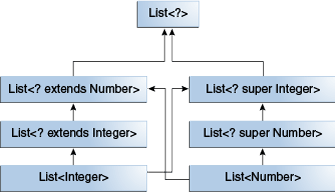

## 通配符和子类型

在前面的泛型、继承&子类型一节，已经介绍过，如果仅仅是因为泛型类和接口之间的类型参数之间有继承关系，那么泛型类和接口之间是并不相关的。但是，你可以使用通配符使泛型类和接口之间有关系。


考虑如下的两个class：

```
class A { /* ... */ }
class B extends A { /* ... */ }

```

那么，根据多态，我们可以编写如下代码：

```
B b = new B();
A a = b;

```

上述规则是成立的，而且是广泛使用的，但是对于泛型类或者接口，这个规则不再成立：

```
List<B> lb = new ArrayList<>();
List<A> la = lb;   // compile-time error, 编译会报错

```

Integer类是Number类的子类，那么List<Integer>和List<Number>之间是什么关系？尽管Integer是Number的子类，但是List<Integer>并不是List<Number>的子类，实际上，二者之间毫无联系，如果说有任何一点联系的话，那就是它们的父类都是List<?>,如下图所示：


为了使这些类之间有联系，使得代码可以通过List<Integer>的元素访问Number的方法，使用一个有上限的通配符：


```
List<? extends Integer> intList = new ArrayList<>();
List<? extends Number>  numList = intList;  // OK. List<? extends Integer> is a subtype of List<? extends Number>


```

因为Integer是Number的子类，numList一个存放Number的列表，现在intList合numList之间就有了某种联系，下面的图表展现了这些关系：





