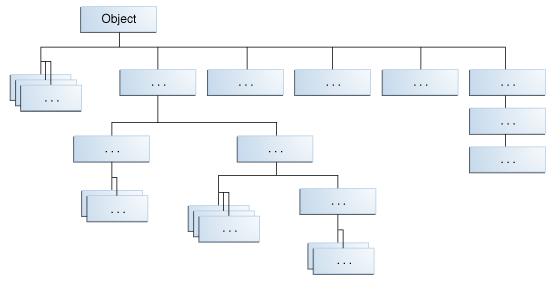

## Interitance

在前面的章节中，我们已经提过多次继承的概念。在java编程语言中，一个类可以从其他类衍生而来，从而继承其他类的域和方法。

** 定义：一个从其他类衍生而来的类叫做subclass（或者derived class，extended class，child class）。被继承的类称为superclass（或者base class，parent class）。**

除了Object没有父类之外，其他的类都有且仅有一个直接父类（又称单继承）。如果没有显示指定直接父类，一个类默认的父类是Object。

一个类可以继承另一个类，而被继承的类又可以继承另一个类。。最终会到达最顶端的类--Object。

继承的思想简单而强大：当你想要创建一个新的类，而此时已经存在一个类包含你想要的代码，你可以使你的类继承这个已有的类，从而重用已有的类的域和方法而不是重新发明轮子。

一个子类从它的父类中继承了所有的成员（域、方法和嵌套类）。构造方法不是成员，因此它不会被继承，但是子类可以调用父类的构造方法。

### java平台类层次结构

Object类，定义在java.lang包中，定义并实现了所有类的通用行为--包括你自己编写的类。在java平台中，许多类直接从Object衍生而来，其他类又从这些类衍生而来，凡此种种，组成了一个类层次结构。




类层次结构的顶端是最通用的Object类，底端类提供了更具体的行为。

#### 继承的例子

```
public class Bicycle {
        
    // the Bicycle class has three fields
    public int cadence;
    public int gear;
    public int speed;
        
    // the Bicycle class has one constructor
    public Bicycle(int startCadence, int startSpeed, int startGear) {
        gear = startGear;
        cadence = startCadence;
        speed = startSpeed;
    }
        
    // the Bicycle class has four methods
    public void setCadence(int newValue) {
        cadence = newValue;
    }
        
    public void setGear(int newValue) {
        gear = newValue;
    }
        
    public void applyBrake(int decrement) {
        speed -= decrement;
    }
        
    public void speedUp(int increment) {
        speed += increment;
    }
        
}

```

MountainBike类继承了Bicycle类：

```
public class MountainBike extends Bicycle {
        
    // the MountainBike subclass adds one field
    public int seatHeight;

    // the MountainBike subclass has one constructor
    public MountainBike(int startHeight,
                        int startCadence,
                        int startSpeed,
                        int startGear) {
        super(startCadence, startSpeed, startGear);
        seatHeight = startHeight;
    }   
        
    // the MountainBike subclass adds one method
    public void setHeight(int newValue) {
        seatHeight = newValue;
    }   
}

```

MountainBike继承了Bicycle类的所有域和方法，并且添加了seatHeight域和相应的set方法。除了构造器，看起来就像你从头开始编写了一个全新的MountainBike类一样，这个类具有4个域和5个方法。但是，你并没有逐行编码。如果Bicycle类的方法很复杂，而且花费了长时间调试的话，继承将会十分有用。

#### 你在subclass里可以做什么


subclass集成了parent的所有public和protected成员，不管这个subclass在哪个package下。如果subclass和superclass在同一个包下，那么subclass还继承了父类中package-private的成员。你可以直接使用继承的成员、替换它们、隐藏它们或者补充新成员：

* 继承的域可以直接使用，就像其他域一样。
* 你可以在subclass中声明一个跟父类中同名的域，然后父类中的域就被隐藏了
* 你可以在子类中声明新域
* 继承的方法可以直接使用
* 你可以编写新的实例方法，这个方法可以与父类中已有的方法签名相同，这时你重写了这个方法。
* 你可以声明一个新的与父类同名的static方法，隐藏父类中同名的方法
* 你可以在子类声明一个新方法
* 你可以编写子类构造器，在子类构造器中调用父类构造器，或者隐式调用，或者显示的使用super关键字。

#### Superclass中的私有成员

一个subclass不是继承父类中的私有成员。但是，如果父类中有public或者protected的方法，这些方法可以访问私有域的话，子类可以调用这些方法。

一个嵌套类可以访问外部类的私有成员--域和方法都可以。因此，一个public或者protected的嵌套类被子类继承后，子类可以间接的访问父类的所有私有成员。

#### 转换对象

我们已经知道一个对象的真实类型，是它实例化时使用的类型。例如，如果我们有如下代码，那么myBike的类型就是MountainBike。

```
public MountainBike myBike = new MountainBike();

```

MountainBike起源于Bicycle和Object。因此，一个MountainBike是一个Bicycle，同时也是一个Object。在任何使用Bicycle或者Object的地方都可以使用MountainBike。

但是，反过来是不成立的：一个Bicycle可能是一个MountainBike，但是不一定是。同样，一个Object可能是一个Bicycle，但是不一定是。

类型转换展示了使用一种类型的对象替换另一种类型，只要这两种类型具有继承和实现关系。例如，如果有如下代码，那么，obj既是一个Object又是一个MountainBike，这叫做隐式转换。

```
Object obj = new MountainBike();

```

如果有如下代码,那么编译器将会产生一条错误，因为编译器不知道obj的真实类型是一个MountainBike。但是，我们可以通过显式类型转换，告诉编译器，我们保证obj指向一个MountainBike对象。

```
MountainBike myBike = obj;

MountainBike myBike = (MountainBike)obj; // explicit casting

```


这种转换插入了一个运行时检查，检查obj被赋值为一个MountainBike对象。因此，编译器可以安全的建设obj是一个MountainBike。如果运行时，obj不是一个MountainBike，那么将会抛出一个异常。

** 你可以使用instanceof关键字，进行一个逻辑判断，判断obj的类型是否是期望类型。这可以使你避免由于转换不当造成运行时错误，例如：

```

if (obj instanceof MountainBike) {
    MountainBike myBike = (MountainBike)obj;
}

```

instanceof关键字会验证obj是否是一个MountainBike的引用，我们可以根据这个信息来安全的进行显示转换而不会引起运行时异常。


### 状态、实现和类型的多继承

类和接口一个重要的不同在于类可以有域但是接口没有。除此之外，你可以实例化一个类来创建一个对象，但是接口同样不可以。在“对象是什么”一节中，我们介绍了，对象在域中存储它的状态，域在类中定义。java不允许多继承的一个原因就是避免状态多继承问题：即从多个类中继承状态。例如，假设你可以定义一个类，这个类可以继承多个类。当你实例化这个类的一个对象时，这个对象将会从所有的父类中继承域。如果不同的父类在方法或者构造方法中初始化了相同的域，怎么办？哪一个方法将优先执行呢？因为接口不包括域，所以实现多个接口不存在状态多继承问题。


实现的多继承指的是从多个类中继承方法。这种多继承也会引起问题，例如命名冲突和歧义。当java编译器支持这种多继承时，它遇到不同的父类包含相同的方法时，它们不知道应该访问哪个域或者调用哪个方法。除此之外，当一个开发人员向父类中添加一个新的域时，可能会无意中引入命名冲突。默认方法引入了一种实现多继承的机制。一个类可以实现多个接口，这些接口可能包括同名的默认方法。java编译器提供了一些规则来决定应该调用哪一个默认方法。

java编程语言支持类型的多继承，即一个类可以实现多个接口。一个对象可以有多种类型：它所属的类的类型以及实现的接口的类型。这意味着如果一个变量是以接口的类型来声明的，那么它的值可以引用任何实现了这个接口的类的实例。这部分知识将在“Using an interface as a Type”一节中讨论。

至于实现的多继承，一个类可以继承在接口中定义的方法（默认方法 or 静态方法）的不同实现。在这种情况下，编译器或者用户必须决定使用哪一个方法。


#### 重写和方法隐藏

##### 实例方法

如果子类中的一个实例方法与父类的实例方法签名（方法名、参数类型和个数）和返回值都相同，我们称子类重写了父类的方法。

子类可以重写父类方法。重写的方法以及被重写的方法具有相同的方法名、参数个数和类型以及返回值。一个重写的方法可以返回被重写方法返回值的子类型，称为协变返回类型。

当重写一个方法时，你可以使用@Override注解，@Override注解可以告诉编译器你正在重写父类的一个方法。然后编译器就可以去检查父类是否存在这个方法，如果不存在，则会产生一条编译错误。

#### 静态方法

如果子类定义了和父类中签名相同的静态方法，那么子类中的静态方法将隐藏父类中的静态方法。

区别隐藏一个静态方法和重写一个实例方法的不同具有重大的意义：

* 当在子类中被重写的实例方法时，调用的是子类的版本
* 调用隐藏静态方法时，取决于是以父类还是子类调用的

代码示例：

```
public class Animal {
    public static void testClassMethod() {
        System.out.println("The static method in Animal");
    }
    public void testInstanceMethod() {
        System.out.println("The instance method in Animal");
    }
}

public class Cat extends Animal {
    public static void testClassMethod() {
        System.out.println("The static method in Cat");
    }
    public void testInstanceMethod() {
        System.out.println("The instance method in Cat");
    }

    public static void main(String[] args) {
        Cat myCat = new Cat();
        Animal myAnimal = myCat;
        Animal.testClassMethod();
        myAnimal.testInstanceMethod();
    }
}

```

Cat类重写了Animal类的实例方法并隐藏了Animal类的静态方法。main方法中创建了一个Cat类的实例，并且调用了testClassmethod静态方法和testInstanceMethod实例方法。输出如下：

```
The static method in Animal
The instance method in Cat

```

#### 接口方法

接口中的默认方法和抽象方法就像实例方法一样会被继承。但是，当父类或父接口中提供了多个签名相同的默认方法时，java编译器会遵循继承规则来解决名字冲突。这些规则遵循如下的原则：

* 实例方法优先于接口的默认方法：考虑如下的类和接口

```
public class Horse {
    public String identifyMyself() {
        return "I am a horse.";
    }
}
public interface Flyer {
    default public String identifyMyself() {
        return "I am able to fly.";
    }
}
public interface Mythical {
    default public String identifyMyself() {
        return "I am a mythical creature.";
    }
}
public class Pegasus extends Horse implements Flyer, Mythical {
    public static void main(String... args) {
        Pegasus myApp = new Pegasus();
        System.out.println(myApp.identifyMyself());
    }
}

```

上述代码的输出是：I am a horse.

* 已经被重写的方法会被忽略，这种情况会在父类型由共同的祖先时发生：

```
public interface Animal {
    default public String identifyMyself() {
        return "I am an animal.";
    }
}
public interface EggLayer extends Animal {
    default public String identifyMyself() {
        return "I am able to lay eggs.";
    }
}
public interface FireBreather extends Animal { }
public class Dragon implements EggLayer, FireBreather {
    public static void main (String... args) {
        Dragon myApp = new Dragon();
        System.out.println(myApp.identifyMyself());
    }
}

```

上述程序的输出是：  I am able to lay eggs.

如果两个或者多个独立定义的default方法发生了冲突，或者是一个default方法和一个抽象方法发生了冲突，那么java编译器会产生编译错误。这时，你必须显示的重写父类型的冲突方法。

考虑可以飞的计算机控制汽车。你有两个接口提供了前面相同的default方法：

```
public interface OperateCar {
    // ...
    default public int startEngine(EncryptedKey key) {
        // Implementation
    }
}
public interface FlyCar {
    // ...
    default public int startEngine(EncryptedKey key) {
        // Implementation
    }
}

```

那么，一个同时implements这两个接口的类，必须重写方法startEngine。你可以调用父接口中的默认方法，通过使用super关键字：

```
public class FlyingCar implements OperateCar, FlyCar {
    // ...
    public int startEngine(EncryptedKey key) {
        FlyCar.super.startEngine(key);
        OperateCar.super.startEngine(key);
    }
}

```


super关键字前面的接口名，必须是一个直接父接口，这个接口要么直接定义了default方法要么继承了default方法。这种形式的方法调用并不仅限于区别包含同签名的多接口继承的情况。你可以使用super关键字调用类中和接口中的default方法。


从类中继承的实例方法可以重写接口中的抽象方法。考虑如下的接口和类：

```
public interface Mammal {
    String identifyMyself();
}
public class Horse {
    public String identifyMyself() {
        return "I am a horse.";
    }
}
public class Mustang extends Horse implements Mammal {
    public static void main(String... args) {
        Mustang myApp = new Mustang();
        System.out.println(myApp.identifyMyself());
    }
}

```

程序的输出是 I am a horse. Mustang类继承了Horse类的identifyMyself方法，相当于重写了Mammal接口中的identifyMyself抽象方法。

** 接口中的静态方法永远不会别继承 **

#### 访问修饰符

重写一个方法时，访问修饰符只允许向更宽松的方向改变。例如，一个在父类中的protected的实例方法，可以在子类中变为public的，但是不能变为private或者package-private的。

你会得到一条编译时错误，如果你试图将父类中的一个实例方法变为static方法，或者将父类中的static方法变为子类中的实例方法。

#### 总结

下面的表格总结了，当你在子类中定义与父类中相同签名的方法时，发生的结果：


|| superclass instance method | superclass static method|
|----|----------------------------|-------------------------|
|subclass instance method| overrides | generates a compile-time error|
|subclass static method|generates a compile-time error|hides|


