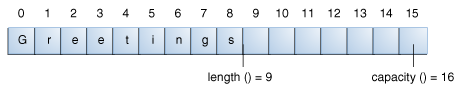

### StringBuilder 类

StringBuilder对象与String对象类似，但是StringBuilder对象可以被改变。在内部，这个对象保有一个可变长度的字符数组。在任何时候，StringBuilder对象中字符数组的长度和内容都可以通过方法调用被改变。

你应该总是首先使用String，除非在以下两种情况：

* 使用StringBuilder简化代码
* 使用StringBuilder提升程序性能

如果你在进行大量的字符串连接操作，使用StringBuilder的append方法可以提供更好的性能。


#### Length 和 Capacity

StringBuilder类也有一个类似于String的length()方法。除此之外，StringBuilder类还有一个capacity，代表可以容纳的字符数量。capacity()方法将会返回capacity，总是会大于等于length，并且会在必要时进行扩展。


|Constructor|Description|
|-----------|-----------|
|StringBuilder()|创建一个StringBuilder对象，其capacity为16|
|StringBuilder(CharSequence cs)|创建一个与CharSequence对象包含相同字符的StringBuilder对象，并且会额外分配16个元素空间|
|StringBuilder(int initCapacity)|根据初始的capacity，创建一个空的StringBuilder对象|
|StringBuilder(String s)|创建一个与String对象包含相同字符的StringBuilder对象，并且会额外分配16个元素空间|


例如下面的示例代码：


```
// creates empty builder, capacity 16
StringBuilder sb = new StringBuilder();
// adds 9 character string at beginning
sb.append("Greetings");

```




StringBuilder类有几个String类不具备的关于length和capacity的方法：

|Method|Description|
|void setLength(int newLength)|设置length。如果newLength比length()小，newLength之后的字符将会被截断，如果newLength比length()大，那么length()和newLength之间将会填充空字符'\0'|
|void ensureCapacity(int minCapacity)|保证capacity大于等于minCapacity|


很多操作（例如append(), setLength()，将会改变字符序列，增加length，所以，当新的length()大于capacity()时，capacity将会自动增加）。


#### StringBuilder操作

StringBuilder具备而String类不具备的最主要的操作就是append和insert方法。这两个方法已经被重载过了，它可以接受任意类型的参数。每一个方法将会把参数转化为一个string，然后添加到StringBuilder的末尾或者插入到指定位置。


|Method|Description|
|------|-----------|
|StringBuilder append(boolean b)||
|StringBuilder append(char c)||
|StringBuilder append(char[] str)||
|StringBuilder append(char[] str, int offset, int len)||
|StringBuilder append(double d)||
|StringBuilder append(float f)||
|StringBuilder append(int i)||
|StringBuilder append(lonh lng)||
|StringBuilder append(Object obj)||
|StringBuilder append(String s)|将参数添加到StringBuilder对象的末尾|
|StringBuilder delete(int start, int end)||
|StringBuilder deleteCharAt(int index)|删除制定位置的字符或者字符序列|
|StringBuilder insert(int offset, boolean b)||
|StringBuilder insert(int offset, char c)||
|StringBuilder insert(int offset, char[] str)||
|StringBuilder insert(int index, char[] str, int offset, int len)||
|StringBuilder insert(int offert, double d)||
|StringBuilder insert(int offset, float f)||
|StringBuilder insert(int offset, int i)||
|StringBuilder insert(int offset, long lng)||
|StringBuilder insert(int offset, Object obj)||
|StringBuilder insert(int offset, String s)|指定位置插入|
|StringBuilder replace(int start, int end, String s)|替换字符串|
|void setCharAt(int index, char c)|设置指定位置的字符|
|StringBuilder reverse()|反转StringBuilder中的字符序列|
|String toString()|转换为String对象|


** 注意，你可以在任意可以使用String对象的地方使用StringBuilder对象，只需要调用StringBuilder的toString方法。反之，可以使用StringBuilder的构造方法，将String对象转换为StringBuilder对象。**


#### 示例

```
public class StringDemo {
    public static void main(String[] args) {
        String palindrome = "Dot saw I was Tod";
        int len = palindrome.length();
        char[] tempCharArray = new char[len];
        char[] charArray = new char[len];
        
        // put original string in an 
        // array of chars
        for (int i = 0; i < len; i++) {
            tempCharArray[i] = 
                palindrome.charAt(i);
        } 
        
        // reverse array of chars
        for (int j = 0; j < len; j++) {
            charArray[j] =
                tempCharArray[len - 1 - j];
        }
        
        String reversePalindrome =
            new String(charArray);
        System.out.println(reversePalindrome);
    }
}

```


为了完成String的反转，上述程序装字符串转换为字符数组，将逆序的字符存入另一个字符数组中，然后将这个字符数组转换为字符串。

你可以使用StringBuilder的reverse方法来反转字符串，如下所示：

```
public class StringBuilderDemo {
    public static void main(String[] args) {
        String palindrome = "Dot saw I was Tod";
         
        StringBuilder sb = new StringBuilder(palindrome);
        
        sb.reverse();  // reverse it
        
        System.out.println(sb);
    }
}

```

** 注意，JDK中还有一个StringBuffer类，它与StringBuilder几乎是等价的，除了它的操作是线程安全的，因为它的所有方法都是synchronized的。关于线程将会在并发一章进行讲解。**


